# TVS Centra Restoration — Photo Journal

A photo-by-photo record of bringing my father's TVS Centra back to life, grouped by the stage of the build.

## Before the rescue

### Worn black Centra, left side before restoration

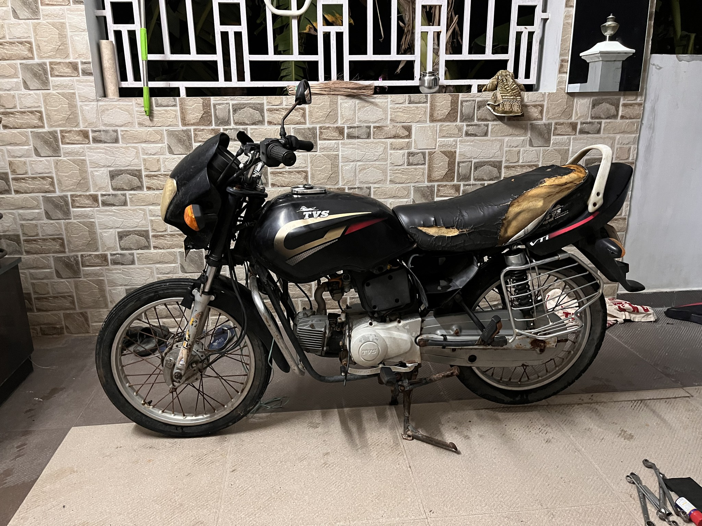

A complete black TVS Centra photographed in left-side profile against a stone-tile wall. The seat is torn with foam bursting out, and there is surface rust on the rear grab rail and frame. Chrome front forks, spoked wheels, the engine, and exhaust are all intact. A TVS logo is on the fuel tank and a 'VTi' graphic is on the side panel. The bike shows heavy, aged use.

### Centra rear view with lights on before teardown

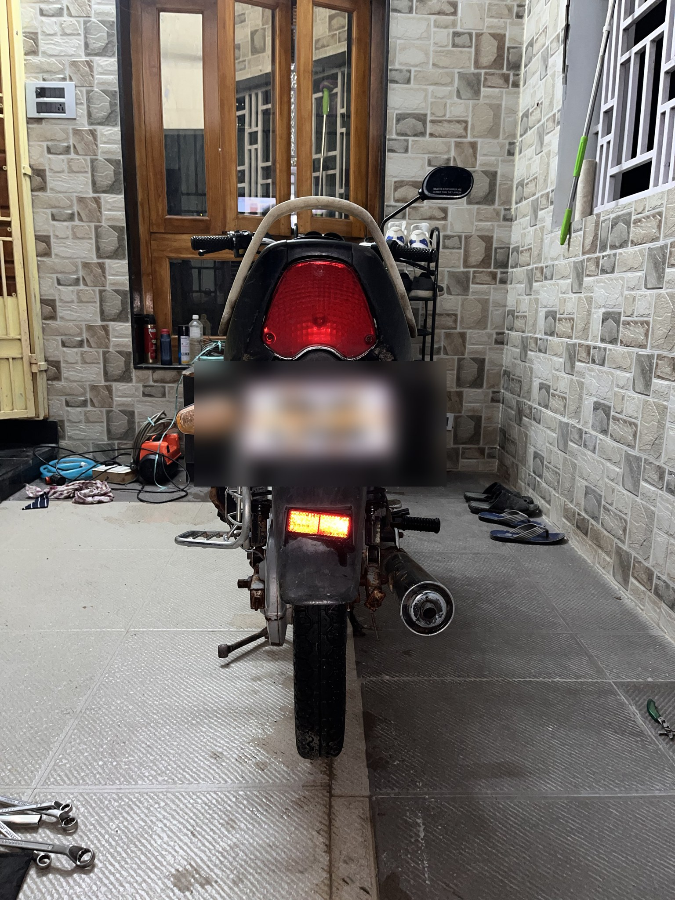

Rear view of the black TVS Centra on a tiled porch at night. The red tail lamp is illuminated and the right turn indicator glows amber, showing the bike still runs. A white number plate is blurred in this repo. The grab rail is wrapped in cloth and the silencer/exhaust below is rusty and worn. The rear spoked wheel and a side stand are visible.

### Father's Centra lower side, torn panel and engine

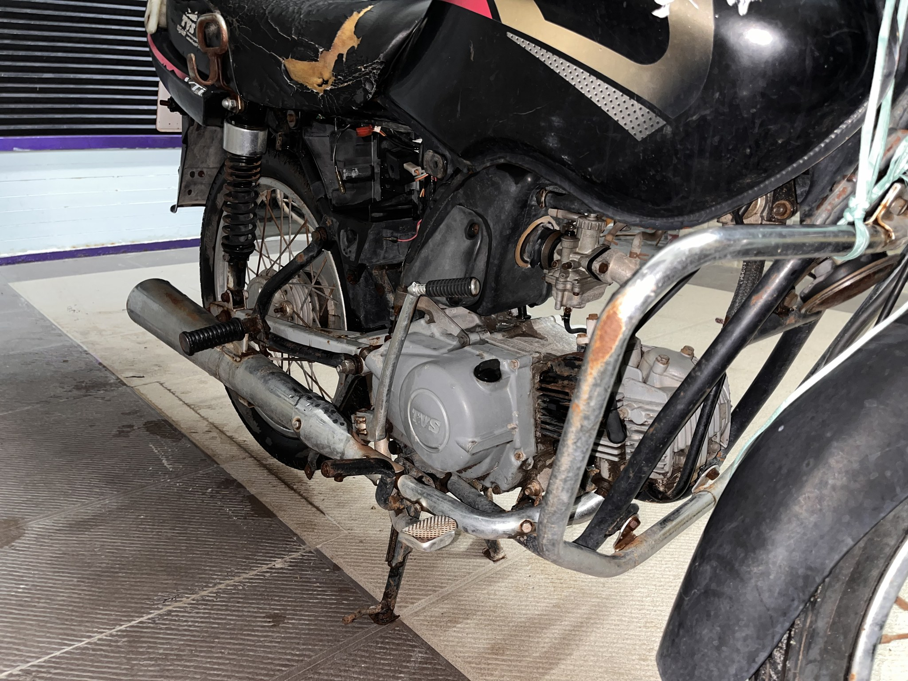

Side view of the lower half of a black TVS Centra. The engine with its TVS-branded cover is central, surrounded by a rusty tubular crash/leg guard. The center stand and side stand are down, a chrome silencer runs along the left, and the rear monoshock and footpeg are visible. The black plastic body panel above the engine is torn and peeling, exposing a beige patch, and surfaces show rust and grime. Setting is a tiled floor near a purple-and-white striped wall.

### Broken side panel and exposed wiring, rusty state

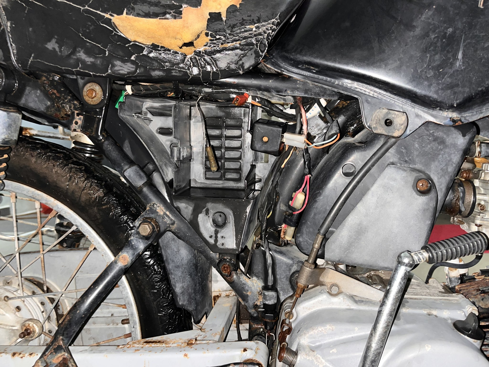

Mid-section view showing a badly cracked and peeling black panel at the top revealing tan material underneath, the rear wheel spokes and rear shock spring on the left, and a central black fuse/relay box with a bundle of connectors and colored wires (red, pink, green and white connectors). Frame tubes and bolts show heavy rust.

### Rusty carburetor and wiring on mounted engine

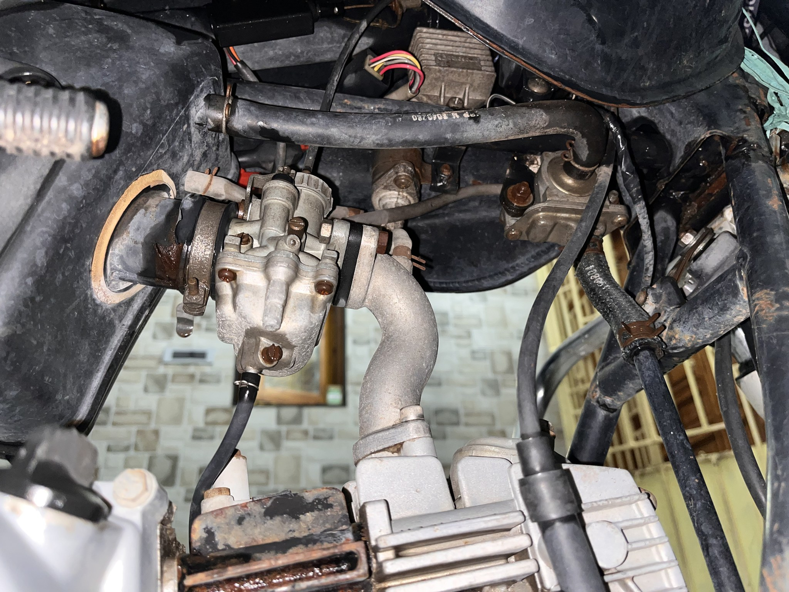

Close-up of a TVS engine's carburetor and aluminum intake manifold with the stock wiring harness and a black electrical unit (with a multi-colored ribbon connector) mounted above. Some brackets and metal parts show surface rust. The bike sits indoors against a tiled wall.

### Carburetor and spark plug cap, engine close-up

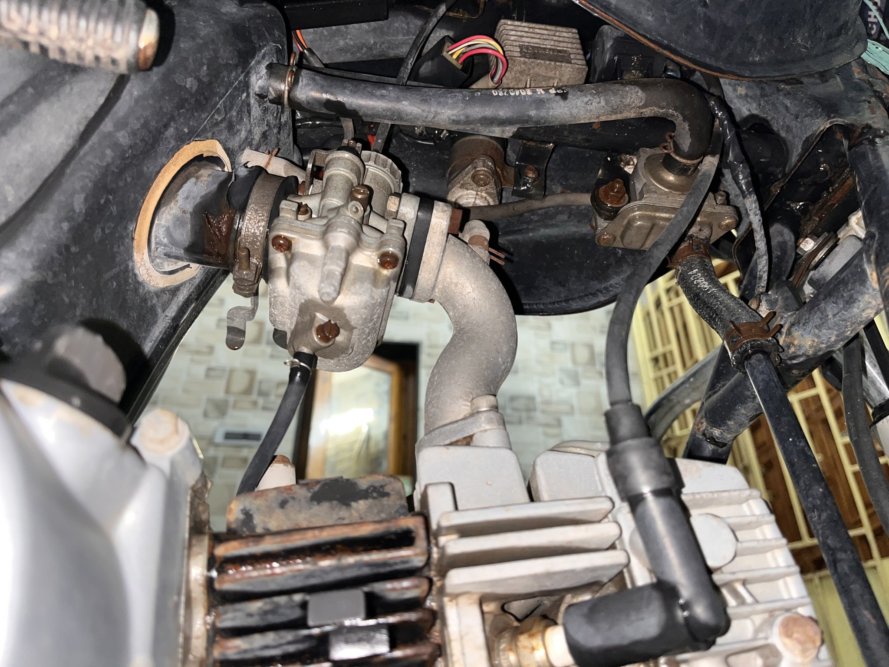

Near-identical close-up of the same carburetor and intake manifold from a slightly different angle, also showing the black spark plug cap on the cylinder head at right and a rusty footpeg bracket at lower left. Stock wiring and the black electrical unit with ribbon connector are visible above.

### Rusted TVS engine and carburetor bay

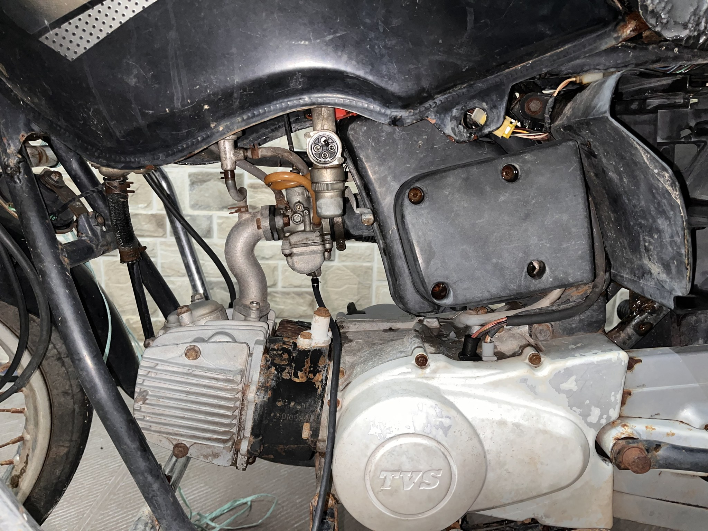

Wider view of the lower engine area showing the TVS-branded engine side cover, the carburetor with an orange fuel line, a fuse/junction box, and stock wiring. Heavy surface rust is visible on the central engine mount plate. Shot indoors against a stone-pattern tiled wall.

## The junkyard donor bike

### Stripped bare frame outdoors, engine removed

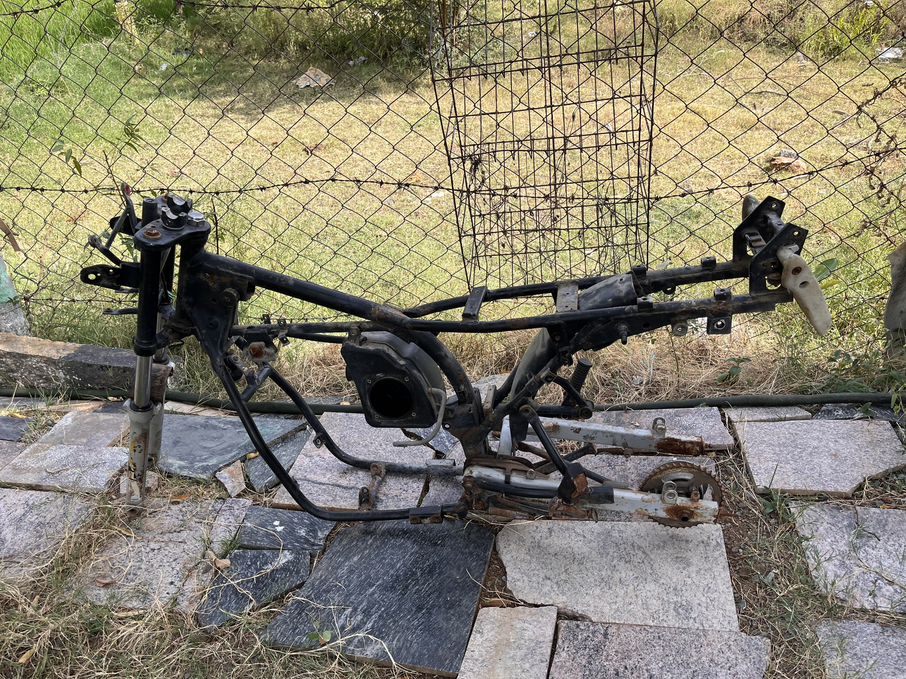

A bare motorcycle frame and chassis rests on stone slabs against a chain-link fence with dry grass behind. The front fork, rear swingarm and rear sprocket are attached, but the engine and all bodywork are missing, leaving an empty engine bay. Surfaces show rust.

## Teardown & restoration

### Centra stripped down during teardown

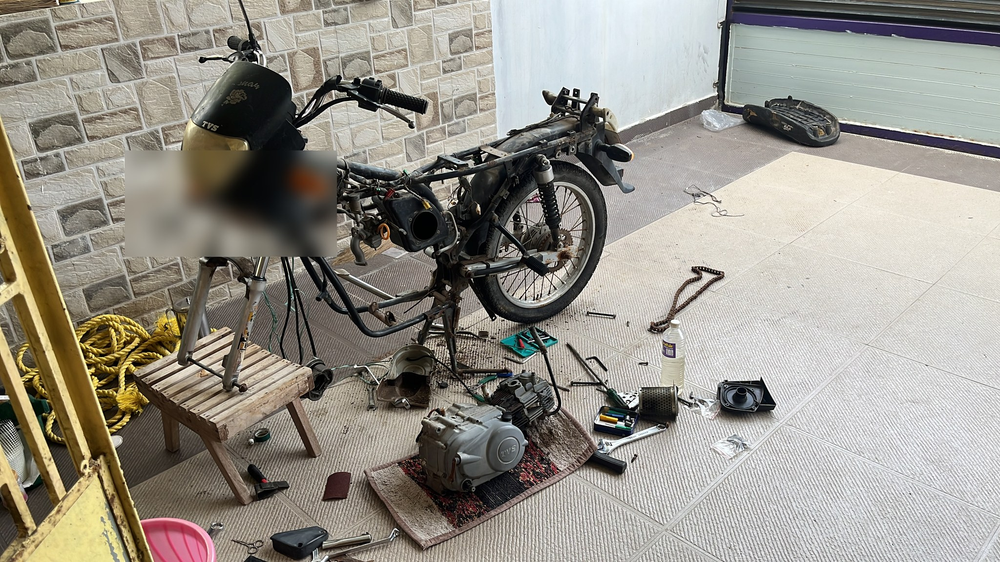

A TVS Centra in mid-teardown on a covered tiled porch. The front frame with forks and a yellowed headlamp fairing is propped up on a wooden stool, and the rear frame with its bare spoked wheel is exposed. A removed engine sits on a small patterned rug on the floor, surrounded by scattered parts including headlight bowls, a drive chain, spanners, screwdrivers, pliers, a bottle of oil, a coiled yellow rope, and a key. The frame is dusty and rusted.

### TVS engine, carburetor and center stand

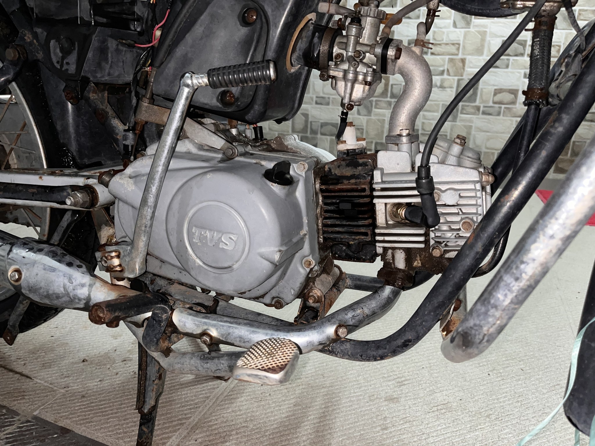

Close-up of the lower right side of the bike showing the grey-silver TVS engine casing with the moulded "TVS" logo, the carburetor and intake at top, a rubber footpeg, the rear brake pedal with a textured metal pad, the deployed center stand, and part of the silencer on the left. Some bolts and brackets show rust; the bike stands on a tiled floor against a tiled wall.

### Rear suspension, engine and exhaust with rust

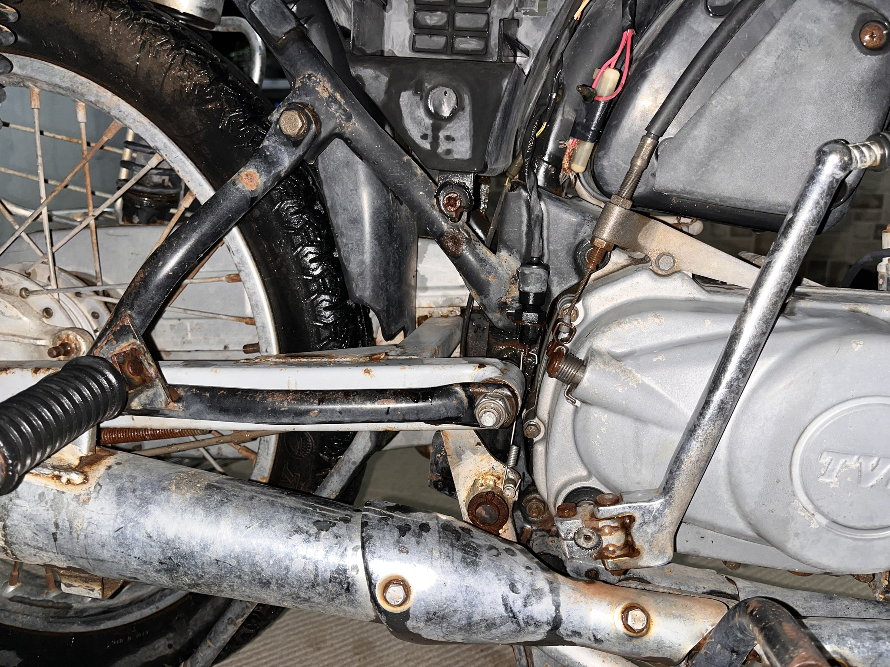

Lower left-side view showing the rear wheel spokes, the rear shock absorber with a rust-streaked spring and threads, the swingarm, the grey engine casing with a partial "TV" logo on the right, a red bullet wire connector near the top, and the silencer/exhaust pipe running along the bottom. Extensive rust is visible on bolts and mounts.

### Rusty left-side drivetrain, panels removed

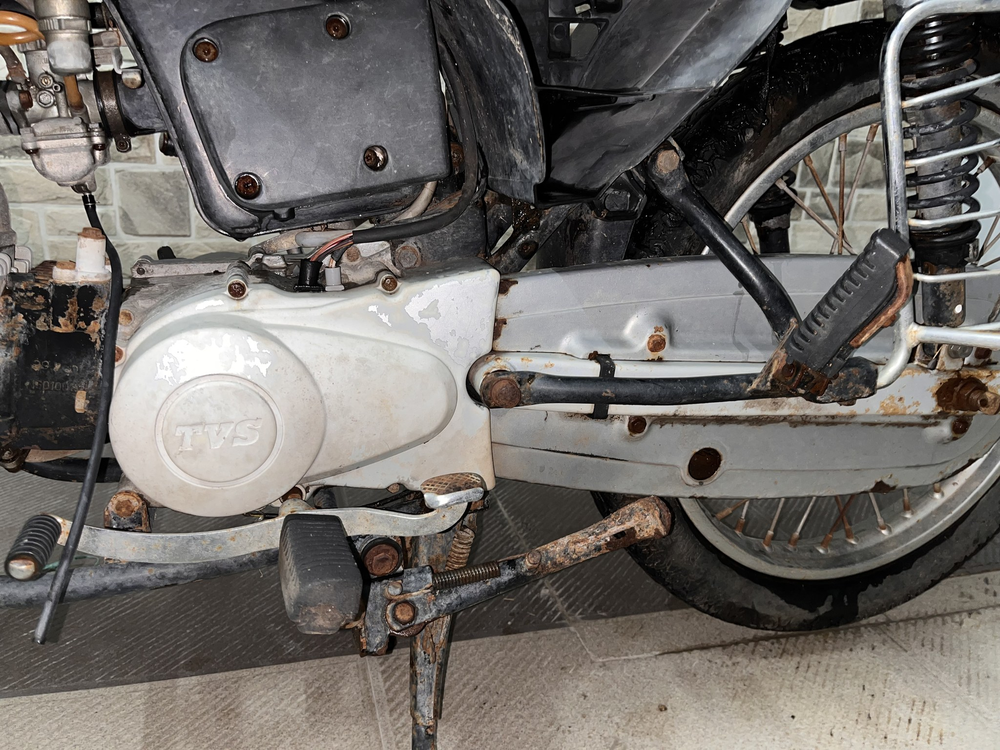

Left side of the TVS moped with plastic side panels absent, exposing the frame. Shows the engine/clutch cover embossed 'TVS', gear-shift lever, kick-start lever, rear spoked wheel, a rear coil-spring shock absorber, footpeg, and the rusty center stand the bike is resting on. Surface rust is present on the stand and swingarm.

### Engine right side with tools laid out

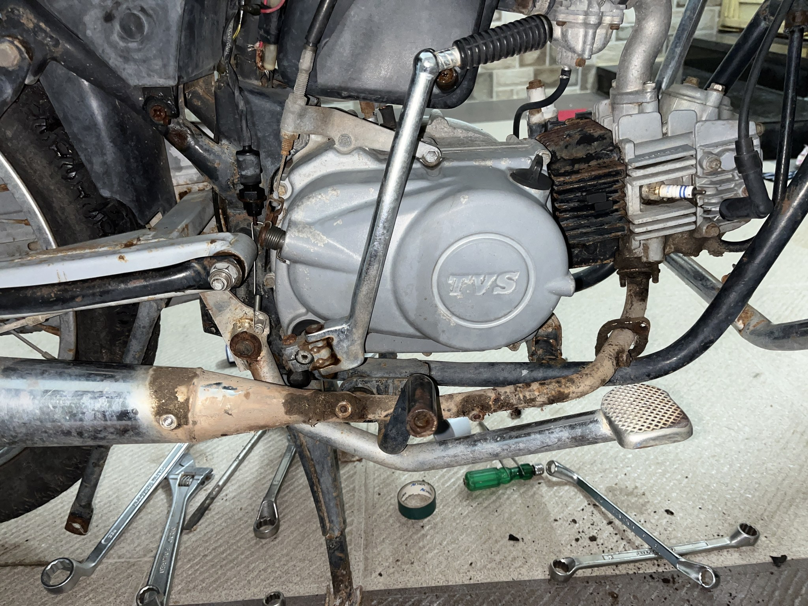

Right side of the same bike on a garage floor with hand tools (open- end and ring spanners, a green-handled screwdriver, a roll of tape) laid out on the tiles. Shows the crankcase cover embossed 'TVS', cylinder-head cooling fins, spark plug, and a rusty silencer/exhaust pipe running along the lower left. Center stand and footpeg are visible.

### Stripped Centra chassis and engine during teardown

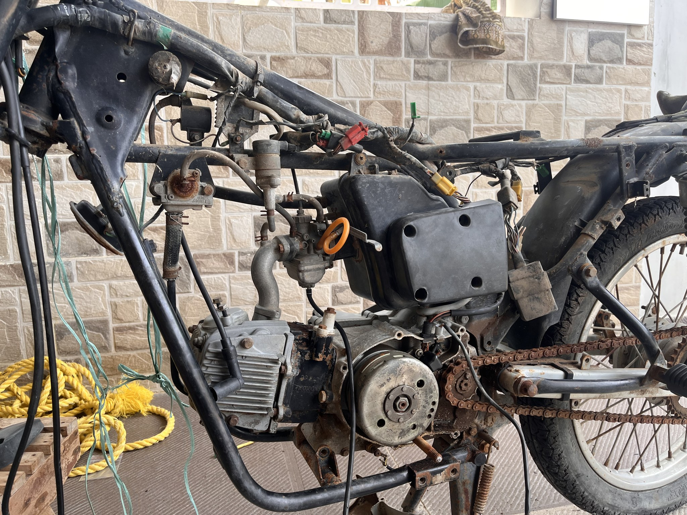

Left-side view of a TVS Centra stripped down to its bare frame with the engine still mounted. Body panels, seat and tank are removed, exposing the carburettor, cylinder, wiring loom with loose bullet connectors, spoked rear wheel and a rusted drive chain. It sits on a workshop floor against a stone-clad wall, with yellow rope and green twine on the ground nearby.

### Stripped Centra chassis, slightly wider teardown view

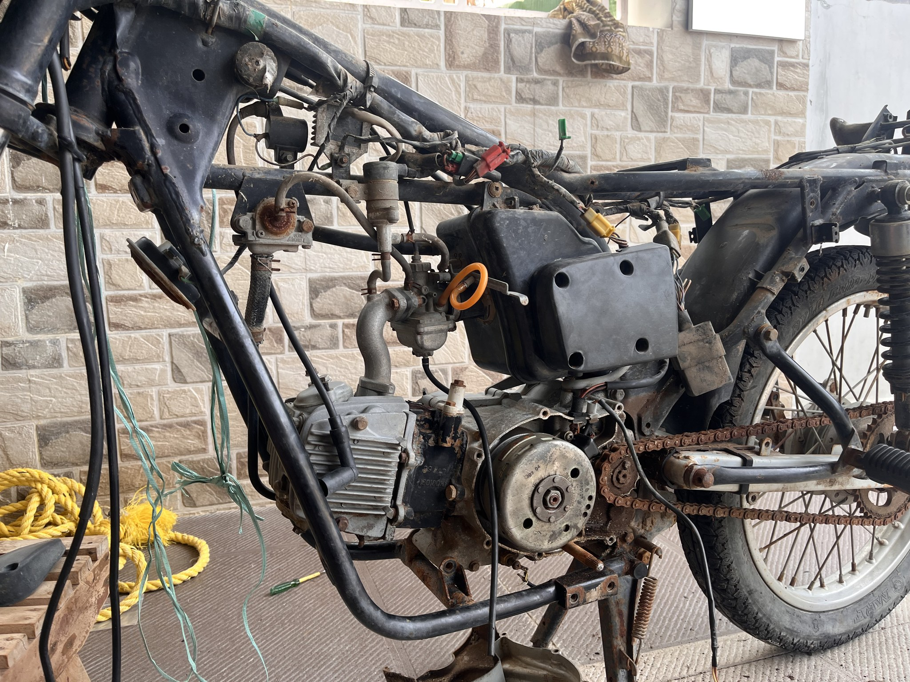

Nearly the same left-side view of the bare TVS Centra frame with engine mounted, framed slightly wider and lower. Shows the exposed wiring harness with dangling connectors, carburettor, cylinder, rusted chain, rear shock and spoked rear wheel, sitting on the workshop floor by a stone-clad wall.

### Engine teardown with flywheel exposed

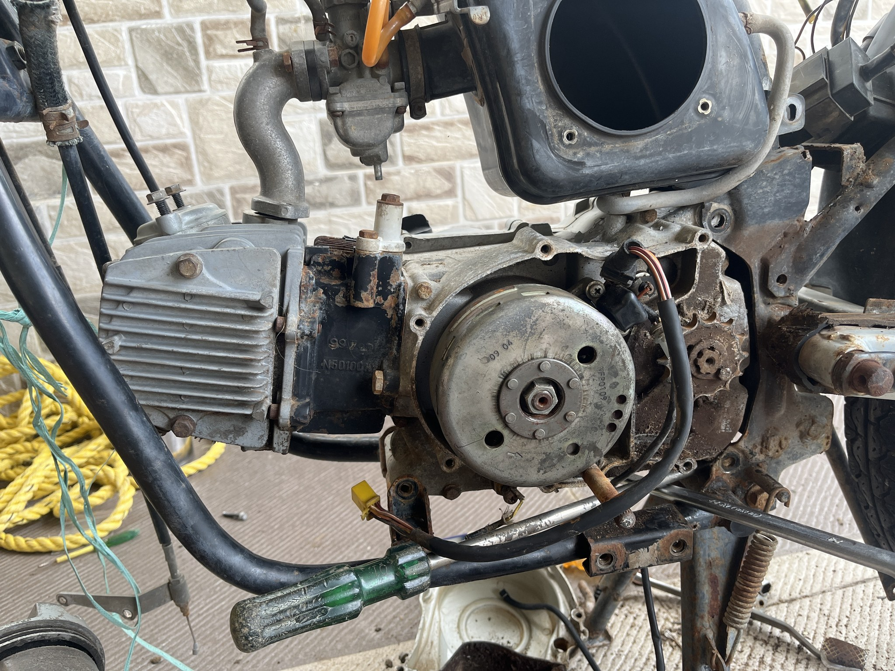

Close-up of a TVS Centra engine still mounted in the frame during dismantling. The cylinder head fins, carburetor, and engine cases are visible, with the magneto/flywheel rotor exposed on the right and brown wiring routed around it. A green-handled screwdriver rests at the bottom and coils of yellow and green rope lie at left against a stone-tiled wall.

### Stripped Centra rolling frame during teardown

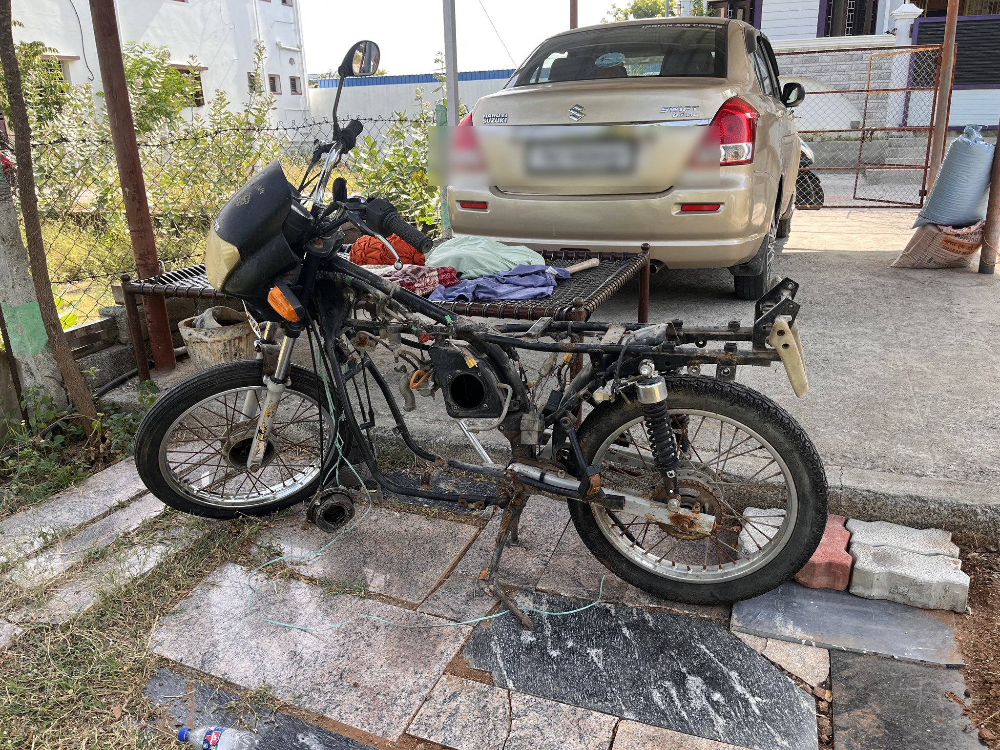

A TVS Centra reduced to a bare rolling chassis stands on paving stones outdoors. It retains both wheels, front forks, handlebar, headlight cowl and rear shock, but the engine, seat, fuel tank and side panels are removed, exposing the empty frame cradle and loose wiring. A gold Maruti Suzuki Swift Dzire car and a cot with clothes are behind it.

### Stripped Centra frame with forks during teardown

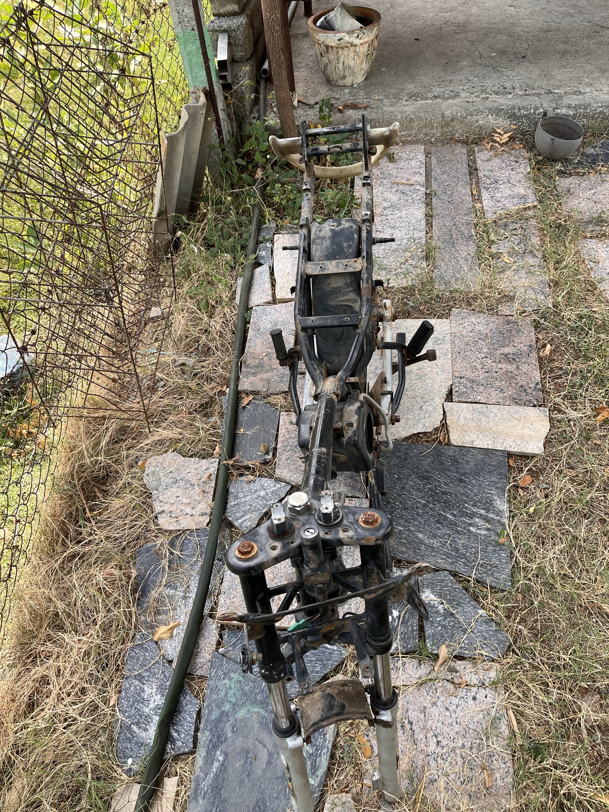

A bare TVS motorcycle frame lying outdoors on paving stones beside a chain-link fence. The frame is stripped of bodywork and engine, showing footpegs, rear carrier rack, and the front fork assembly with triple clamp and twin fork tubes at the bottom of the frame. Surrounded by dry grass and a garden pot.

### TVS Centra staged for work beside tool bench

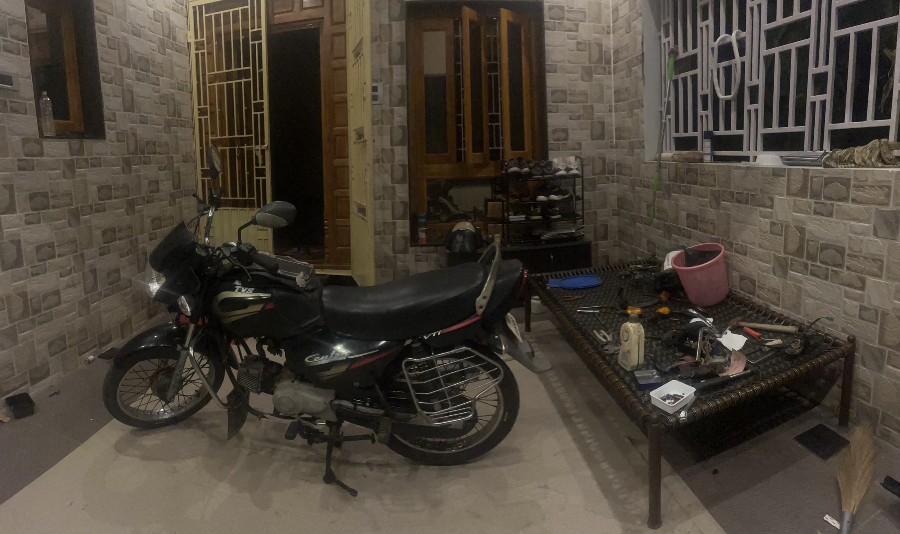

A dark-colored TVS motorcycle on its side stand parked against a stone-textured wall on a home porch at night. Beside it a woven cot (charpai) serves as a workbench holding screwdrivers, small parts, a pink bucket and scattered tools. Open wooden doors and a shelf are in the background.

### Night teardown with parts and engine on porch

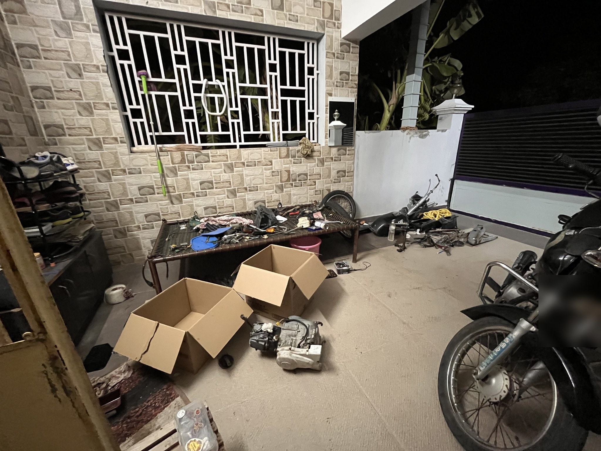

A night-time porch/veranda work area. A metal cot/table holds scattered parts and tools; two open cardboard boxes sit on the tiled floor with a small engine block resting beside them. A partially dismantled motorcycle stands at right, a wheel leans against the patterned wall, and more parts are spread on the ground near a battery charger.

### Dismantled bike parts spread out at night

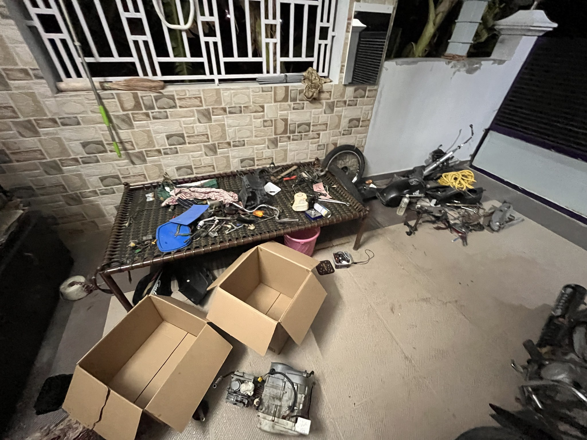

Night-time shot on a tiled house porch. A traditional woven rope cot holds an assortment of small motorcycle parts, hand tools, wrenches, wiring and black plastic panels. In the background a stripped motorcycle frame lies on the floor beside a bare wheel and a coil of yellow rope. Two empty cardboard boxes sit in the foreground, with an engine/carburettor component resting on the floor between them.

### Black Centra standing beside laid-out parts

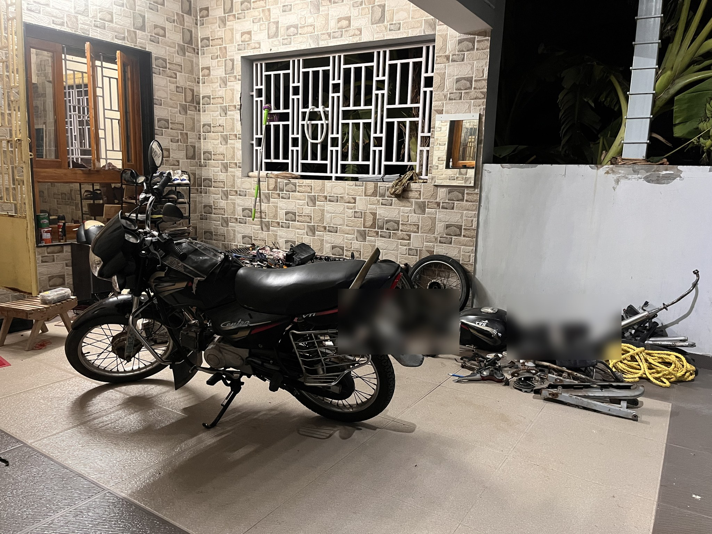

A black TVS Centra motorcycle stands on its stand on a tiled porch, largely assembled, with 'Centra' and 'V11' badging visible on the side panel. To the right on the floor lie numerous removed parts: a bare spoked wheel, a fuel tank, fork tubes, frame brackets, an exhaust/silencer and a coil of yellow rope. A stripped-down number plate is propped among the parts.

### Assembled Centra beside bare donor frame

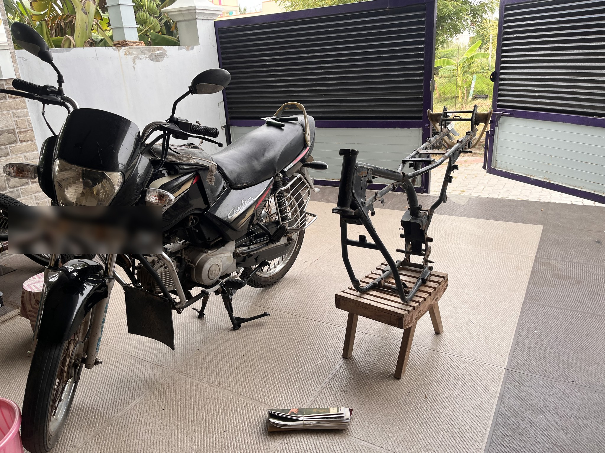

A black TVS Centra motorcycle stands on its stand at left, fitted with seat, mirrors, headlight and side panels. To the right, a bare stripped frame with rear subframe rests on a small wooden stool, showing a donor bike dismantled down to the frame during the restoration.

### Centra being stripped, parts laid out

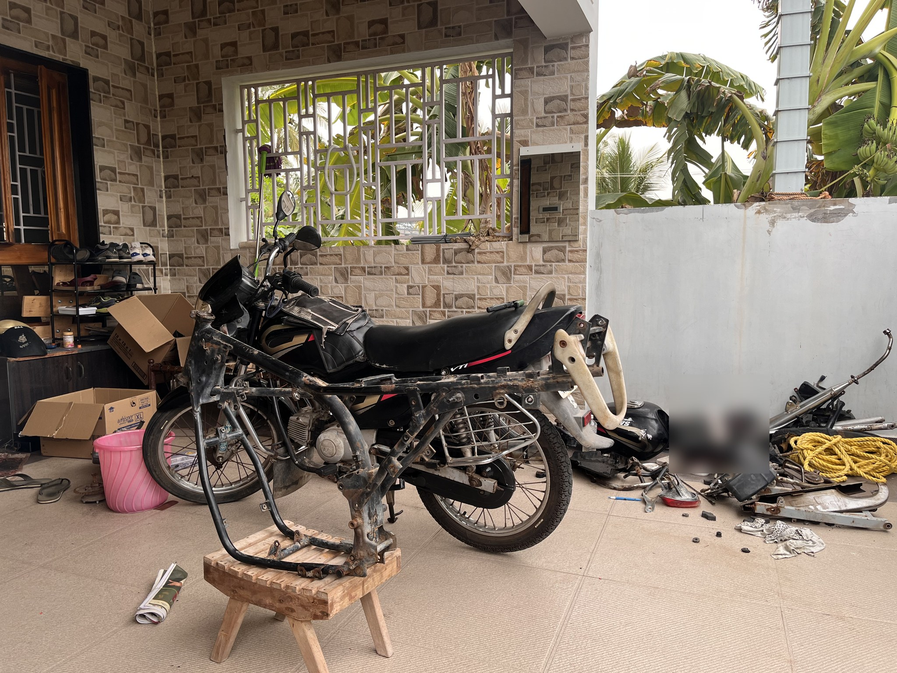

A black TVS Centra motorcycle partially dismantled on a tiled house porch, resting with its engine, front forks, fuel tank and seat still fitted but the rear subframe stripped bare. To the right sits a pile of removed parts from a second bike, a coiled yellow rope, scattered hardware and tools. Cardboard boxes, a pink basin and a footwear rack are against the wall behind. A small wooden stool sits in the foreground.

### Assembled Centra beside stripped bare frame

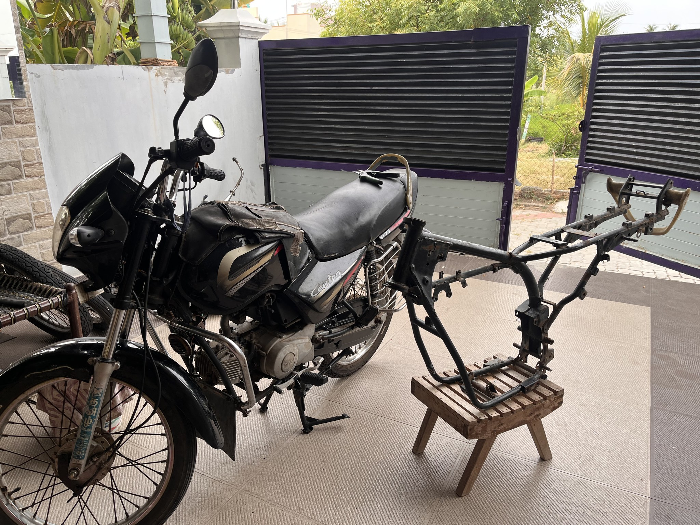

Two TVS Centra two-wheelers side by side on a tiled porch by a dark louvred gate. On the left is a mostly assembled black Centra on its center stand with headlight, round mirror, seat and a tank bearing the 'Centra' badge. On the right stands a completely stripped bare frame with only forks and handlebar-area brackets, propped up with a wooden stool supporting its rear.

### Dismantled parts and tools spread on floor

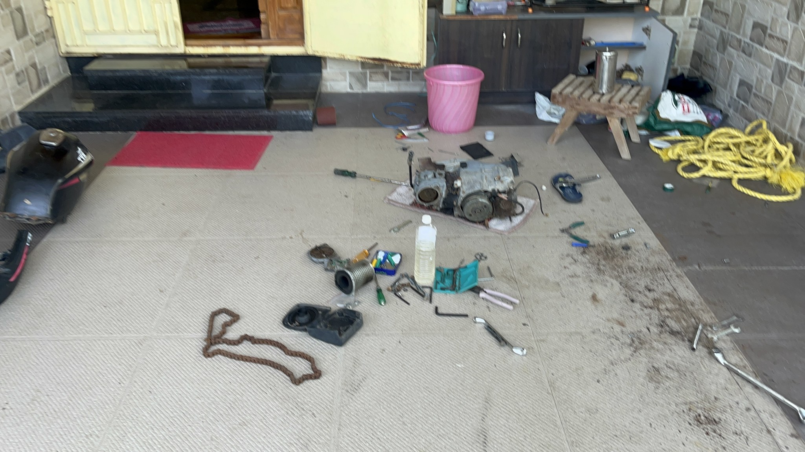

An engine crankcase sits on a cloth in the center of a tiled veranda floor, surrounded by scattered hand tools, an oil/fluid bottle, a drive chain, a carburetor-like part and a dark plastic housing. A pink bucket, yellow rope and a wooden stool are in the background. This is a teardown/dismantling scene with parts laid out.

### Centra mid-restoration with front wheel removed

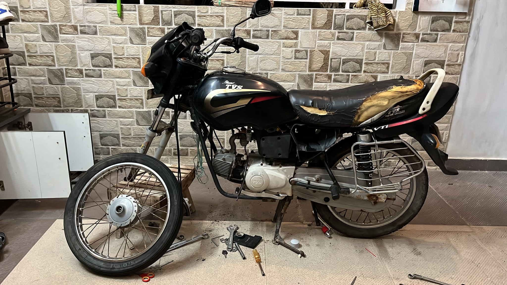

A black TVS Centra motorcycle stood on its stand against a stone-pattern wall, undergoing work. The front wheel has been removed and leans against the front forks; the seat cover is torn and patched with tape exposing foam. Assorted hand tools (spanners, screwdriver, pliers) lie scattered on the floor in front of the bike. A cabinet and shelving are visible on the left.

## The preserved engine

### Removed engine close-up with flywheel exposed

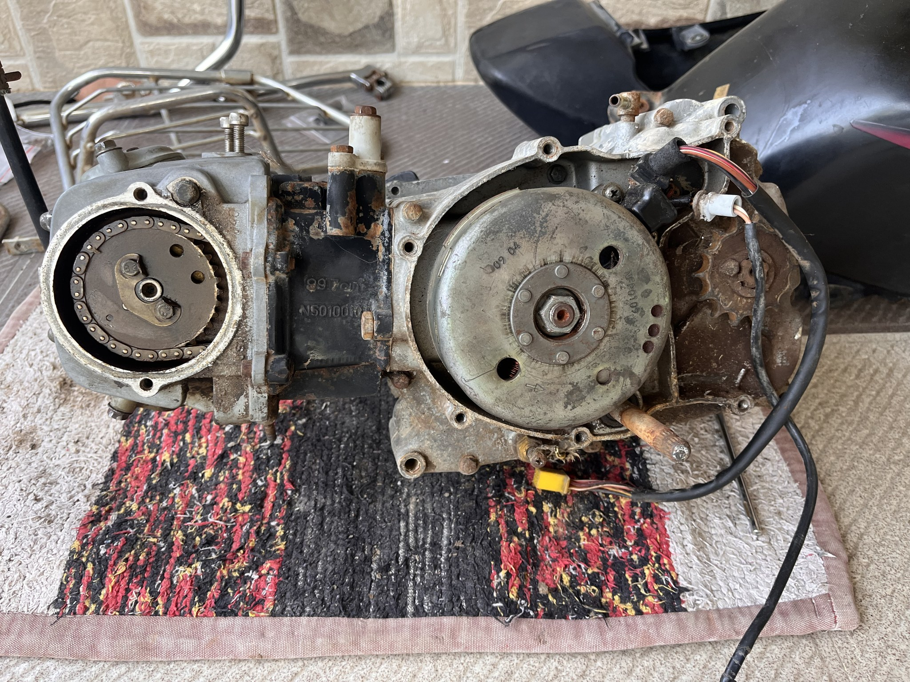

Close-up of a small single-cylinder engine crankcase resting on a red and black woven rug. The left side shows an exposed cam sprocket and chain, and the right side shows the magneto/flywheel with its centre nut, cooling fins and dust. Casting numbers are visible on the case and flywheel, with wiring leads coming out of the unit.

### Engine cylinder head close-up during teardown

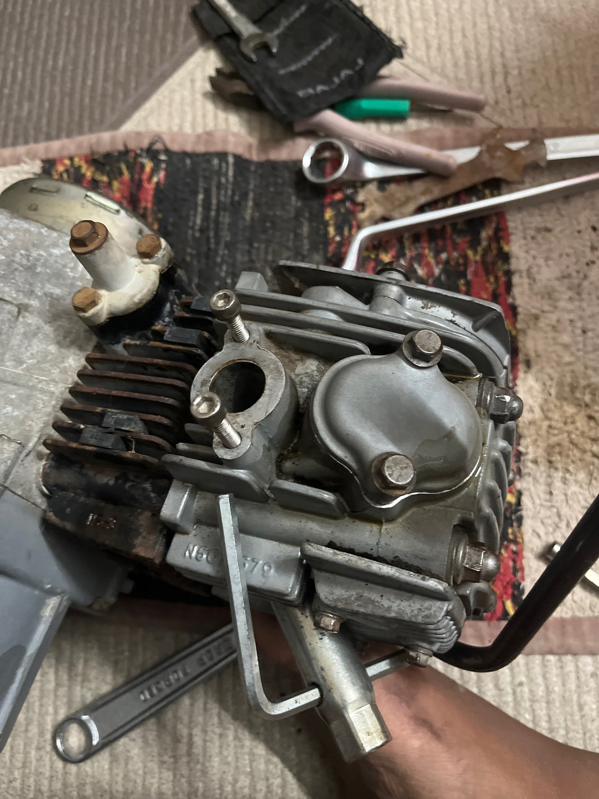

Close-up of a small single-cylinder engine head resting on a floor mat. The cylinder cooling fins are rusted and blackened while the aluminium rocker/cam cover and intake port are bare grey metal. Assorted tools surround it: ring spanners, an allen key, pliers and a black Bajaj-branded pouch. A person's bare foot is visible at the bottom edge.

### Complete old engine removed and set aside

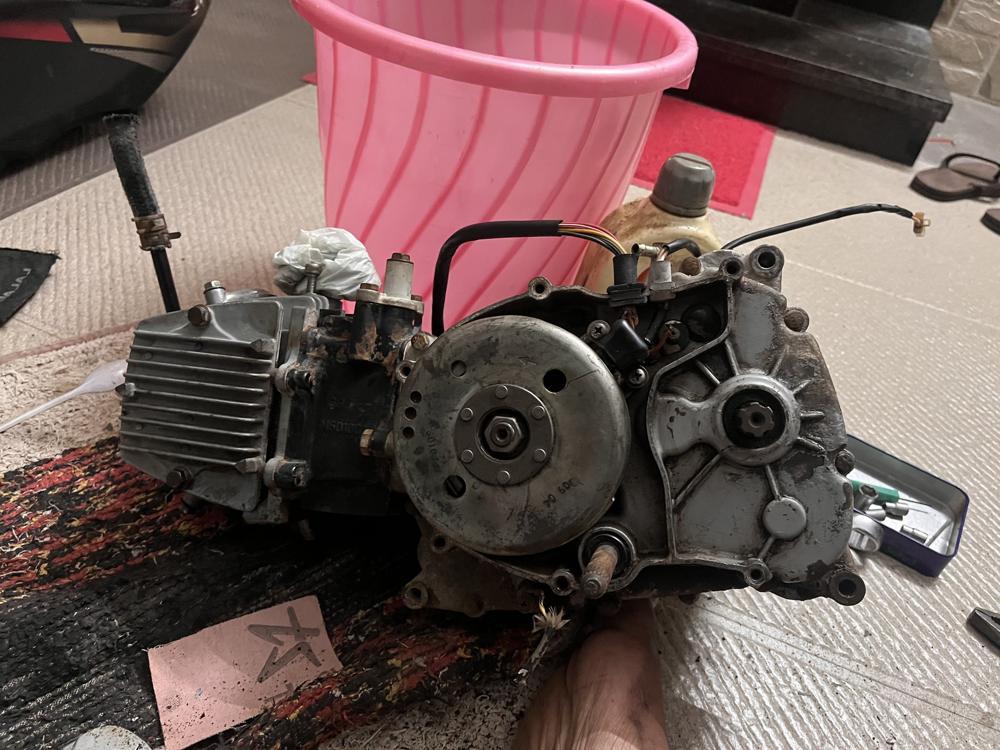

A complete small motorcycle engine (crankcase, cylinder and exposed flywheel/magneto rotor) sitting on the floor on a patterned mat. A pink plastic bucket and a translucent bottle are behind it, and an open tool box is to the right. The engine is dirty and greasy. A bare foot rests at the bottom of the frame.

### Removed TVS engine on the floor

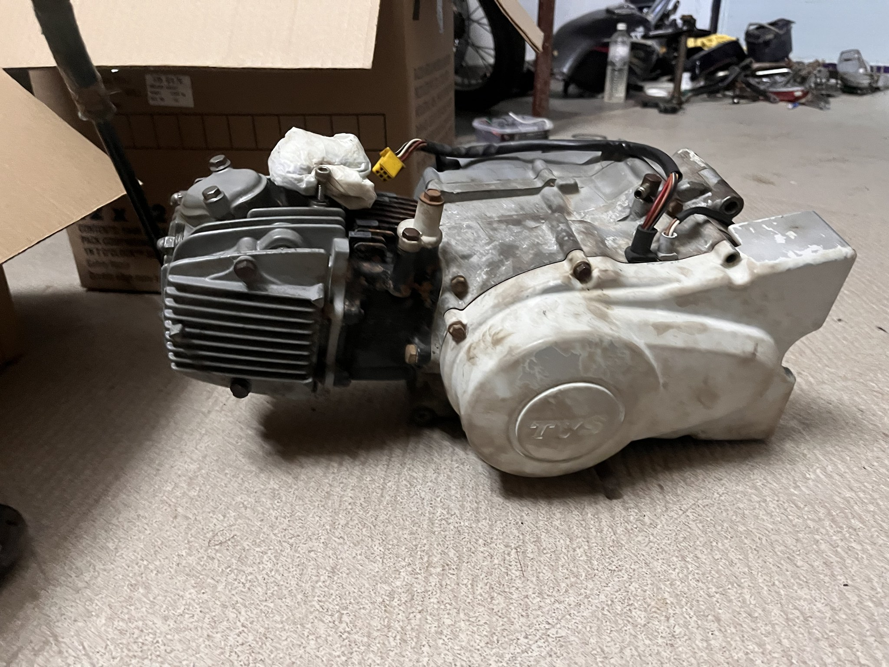

A complete small four-stroke engine-gearbox unit sits on the floor, with finned cylinder head on the left and a light-coloured clutch/crankcase cover cast with the 'TVS' logo on the right. Wiring pigtails and a plugged intake are visible. More stripped bike parts and a frame lie in the background.

## Starter coil & magneto

### Close-up of flywheel magneto and chain drive

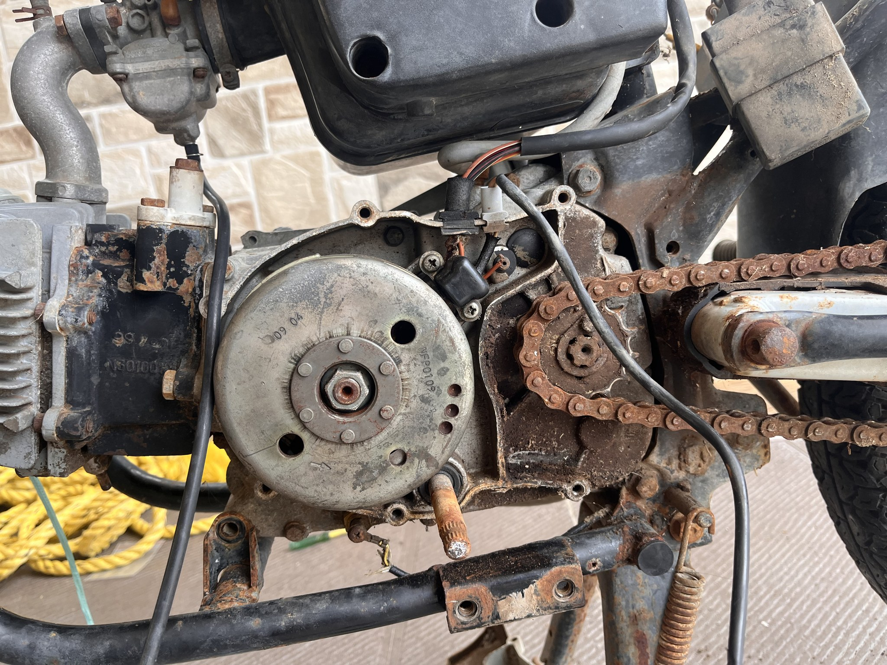

Close-up of the engine's left side showing the round aluminium flywheel magneto/generator cover with a central hub nut, the front drive sprocket and a rusted chain, plus a wiring branch with a rubber grommet and a bullet connector running to a pickup near the crankcase. The carburettor and part of the frame are visible at top; surface rust is present on several brackets and fasteners.

## Speedometer & dash

### Speedometer console and instrument cluster, rider view

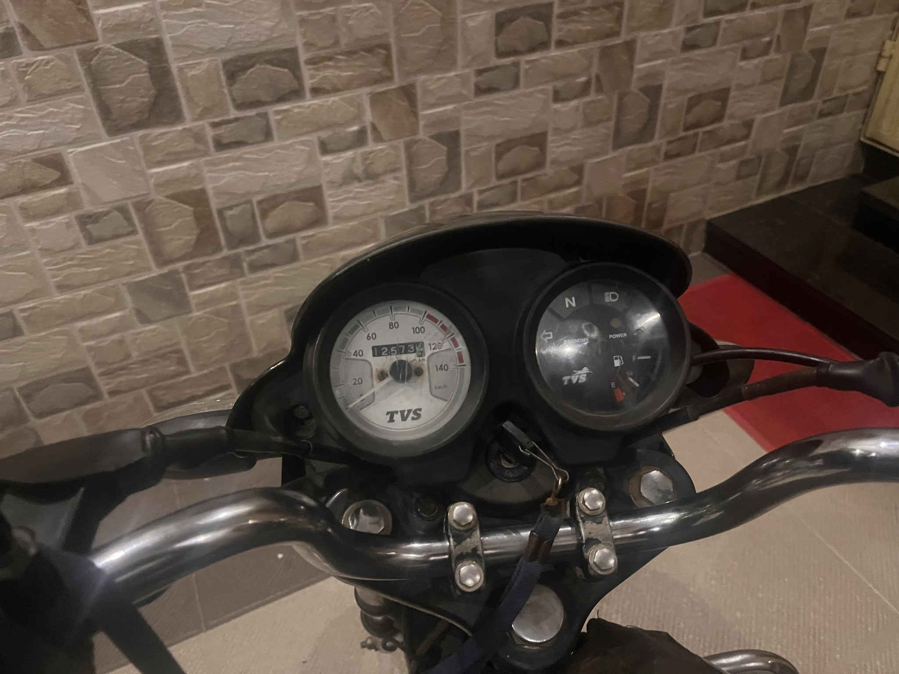

Top-down rider's-eye view of the handlebar and instrument cluster. A round white-faced TVS speedometer (marked 20 to 140 km/h) sits beside a black round gauge with neutral (N), high-beam, POWER and fuel indicator lamps. The odometer window shows a reading. Chrome handlebars, ignition switch and mounting clamp bolts are visible below.

## Center stand

### Center stand and engine lower end

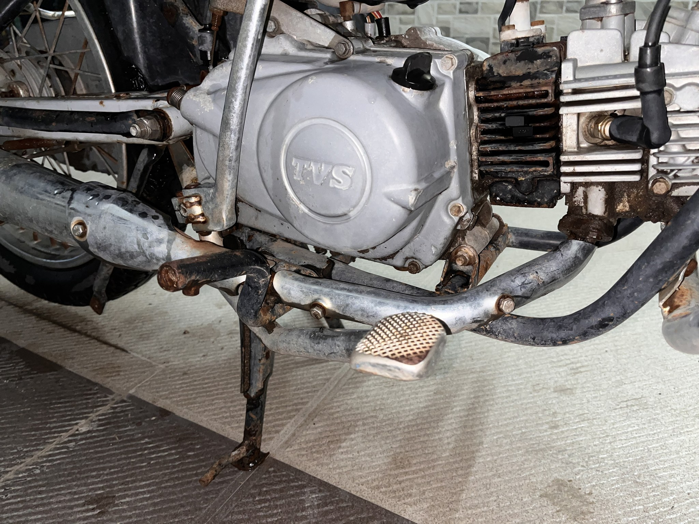

Close-up of the lower end of a mounted TVS engine on a tiled floor. The round engine cover carries an embossed "TVS" logo. Visible are a footrest with a textured metal grip pad, tubular stand bars, a stand leg resting on the floor, and a silencer/exhaust pipe running toward the spoked rear wheel at left. The cylinder head with spark plug and ignition lead is at right, with rust and grime on lower bolts and fins.

### Engine cylinder head and stand, closer view

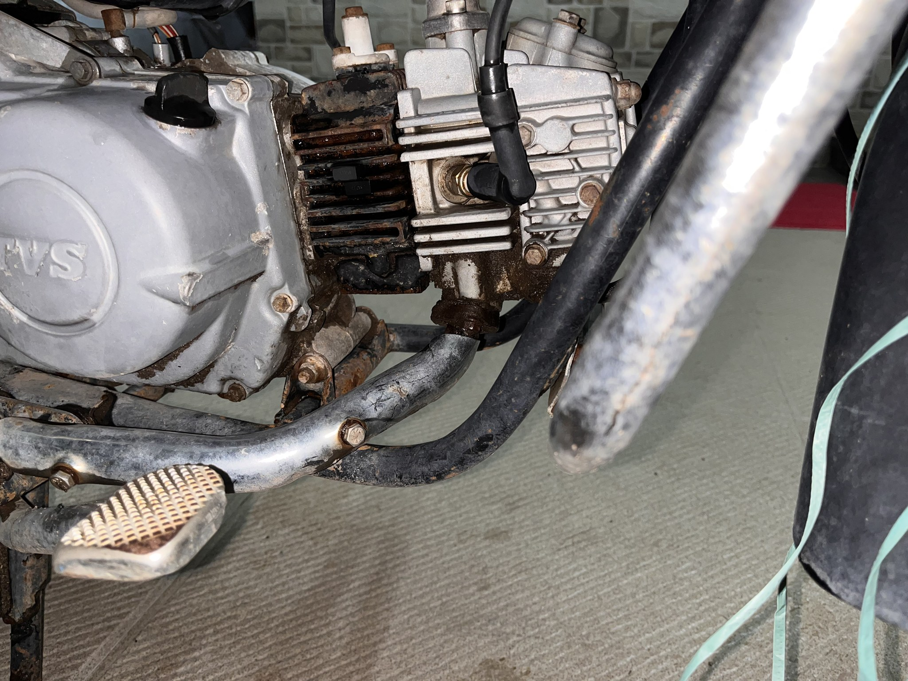

A slightly closer, near-duplicate view of the same engine lower end from a different angle. Shows the cylinder head cooling fins, spark plug cap and ignition (HT) lead, part of the "TVS" engine cover at left, a chrome footrest grip pad, and tubular center-stand bars. On a tiled floor with a length of teal string/twine trailing at right.

## Silencer & exhaust

### Rear wheel, monoshock and silencer with rust

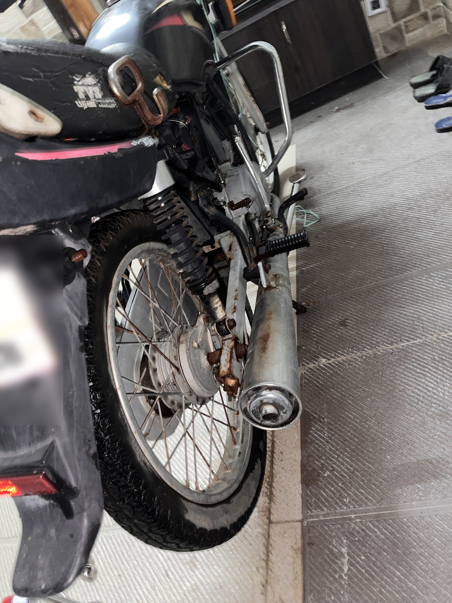

Rear three-quarter view of a black TVS Centra on a tiled garage floor. Shows the spoked rear wheel with heavily rusted spokes and a rusty drum-brake hub, the rear monoshock coil suspension, a chrome tubular silencer/exhaust running along the lower right with rust at its mounting joint, a folding footpeg, chrome grab rail, and the red tail light. Slippers and a cabinet are in the background.

### Removed silencer, tail lamp and rear parts on floor

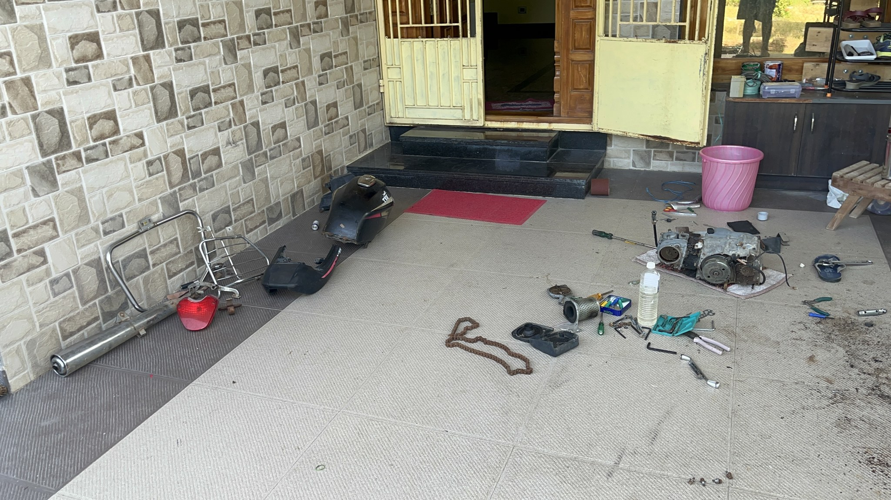

A chrome exhaust silencer/muffler leans against the stone-tiled wall on the left, next to a red rear tail lamp, a rear luggage carrier/grab-rail frame and a black rear mudguard/panel. To the right, an engine crankcase rests on a cloth surrounded by hand tools, a chain and a fluid bottle on the tiled floor. Wider view of the dismantling area.

## Electrical & the DC conversion

### Handlebar wiring and connectors during rework

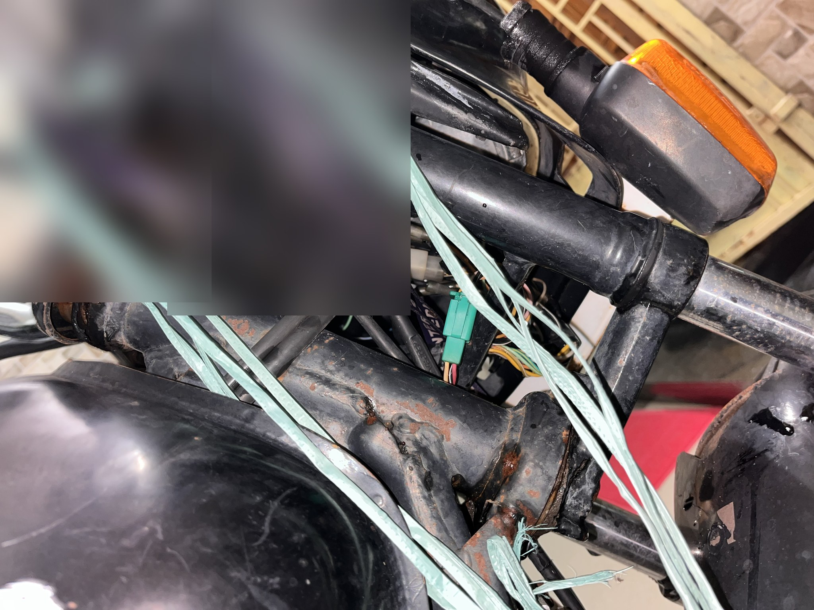

Handlebar/headstock area with a bundle of wiring exposed and being worked on. Multiple wires, a small green two-pin connector and a black multi-pin connector are visible, loosely bound with teal string and a purple school lanyard. An amber turn-signal indicator sits at upper right, with black fork tubes and rusty frame brackets around the harness.

### Exposed front wiring with hand holding bulb holder

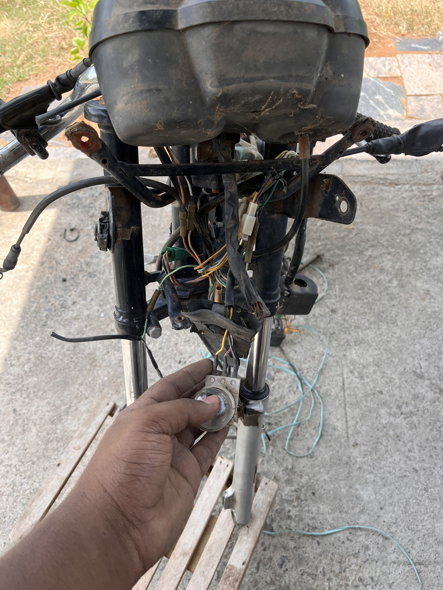

Front of a dismantled TVS Centra viewed from the front: handlebars, a black headlight/instrument housing, chrome and painted front forks, and a large bundle of exposed multicoloured wiring at the steering head. A hand holds a small round component near the lower fork, and loose teal wires lie on the ground. The bike rests on a wooden slat platform.

### Hand holding wiring connector at bike front

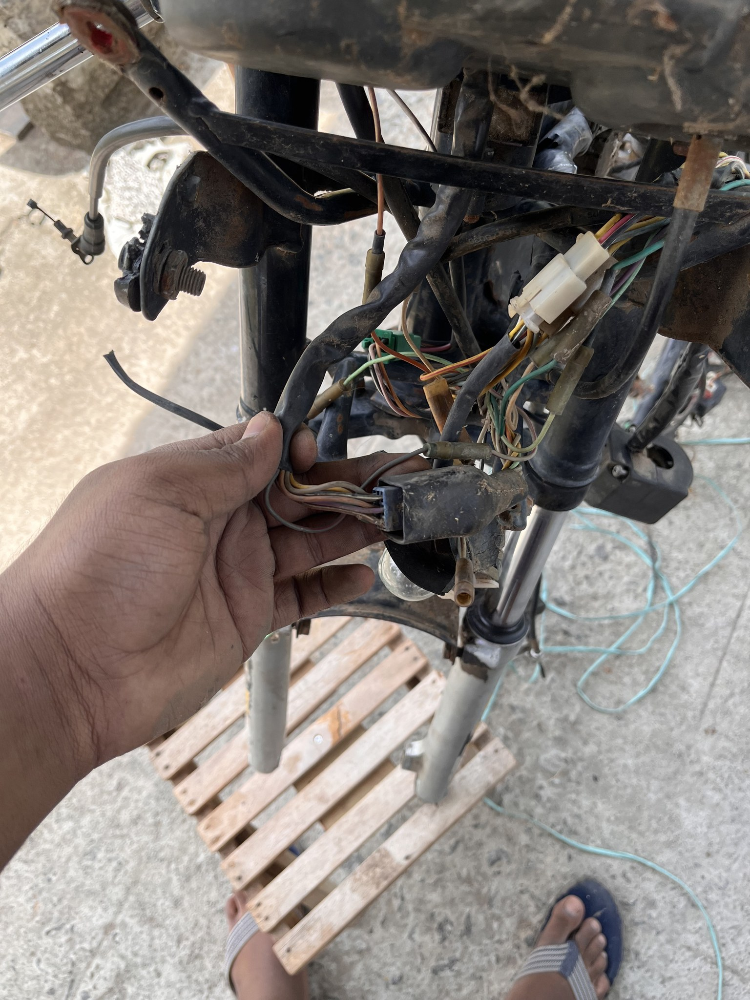

Close view of the front end of the dismantled bike with a dense bundle of exposed multicoloured wiring and connectors at the steering head. A hand pulls out a wiring plug with several coloured wires, chrome and white front forks are visible, and a person's sandalled feet appear at the bottom on the concrete floor next to a wooden slat platform.

### Pointing at headlamp wiring harness connectors

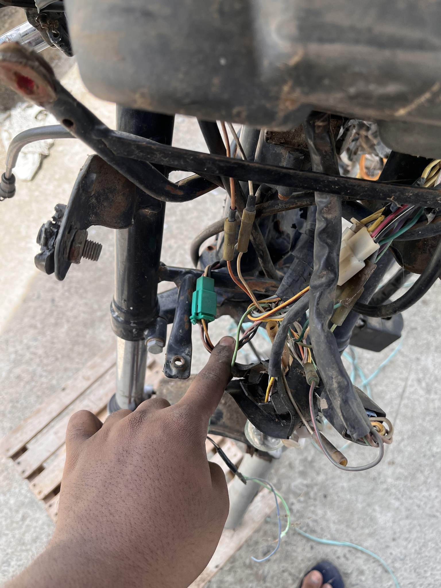

Close-up of the exposed front headlamp/handlebar area of the moped with the fuel tank above and a black fork visible. A hand points at a tangle of the wiring harness where a green two-pin connector and multiple loose colored wires and bullet connectors are visible. The bike sits on a wooden pallet on a concrete floor.

### Holding up front wiring harness and connectors

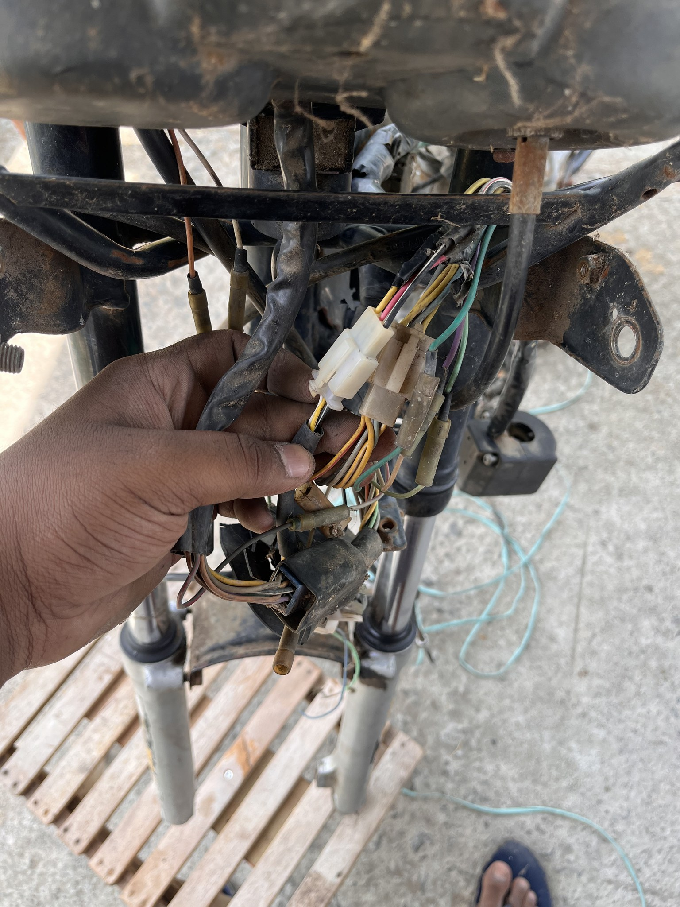

A hand lifts a bundle of the front wiring harness away from the frame, showing several white multi-pin block connectors and many colored wires with bullet terminals. Two silver/chrome front fork tubes stand below and the bike rests on a wooden pallet on concrete. A person's sandalled foot is visible at the lower right.

### Inspecting front harness connectors by hand

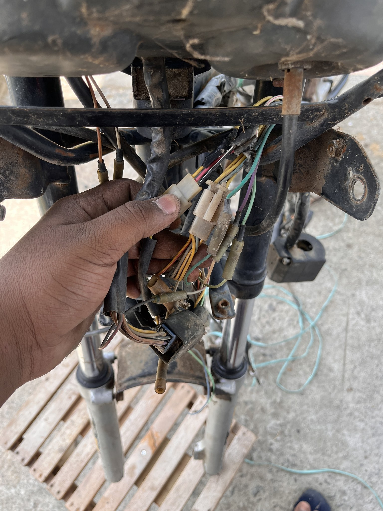

Near-identical view to the previous frame: a hand holds the front wiring harness with white block connectors and colored bullet-terminal wires, with the two chrome front fork tubes below and the bike on a wooden pallet. A sandalled foot appears at bottom right.

### Front wiring harness and fork tubes exposed

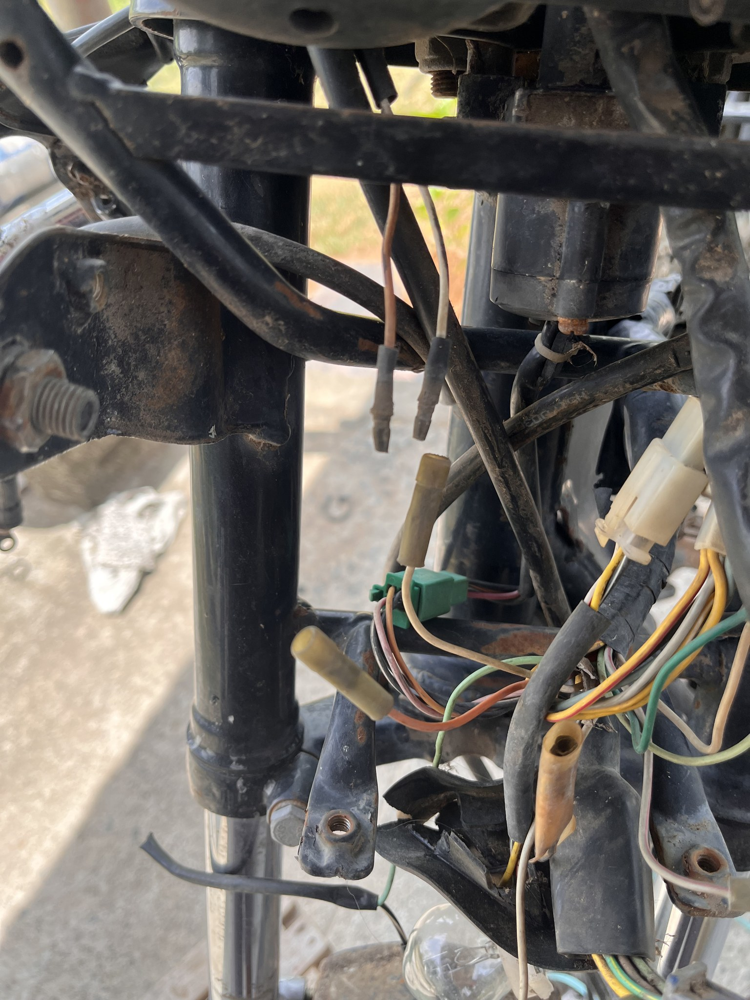

Close-up of the motorcycle's front frame area with the black and chrome fork/steering tubes visible. A bundle of loose wiring hangs down with individual bullet connectors and a green two-pin connector, showing yellow, green, brown and grey wires. Shot outdoors on a concrete floor with the plastic bodywork removed.

### Hand holding a wire bullet connector during rewiring

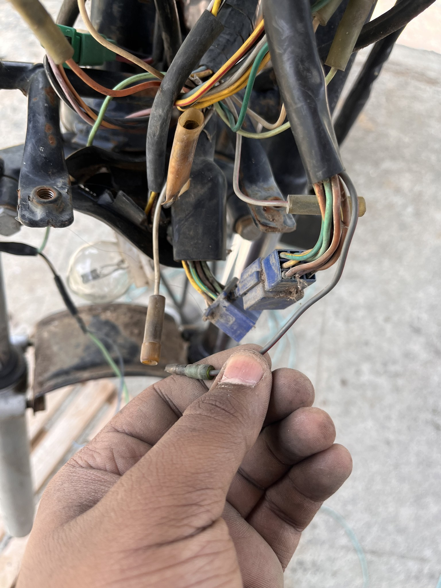

A person's hand holds up a single wire fitted with a metal bullet connector, pulled out from the tangled front wiring harness behind it. The frame, a loose bulb, fork tube and multi-colored wires with square block connectors are visible in the background on a concrete surface.

### Multi-pin wiring connectors on front frame

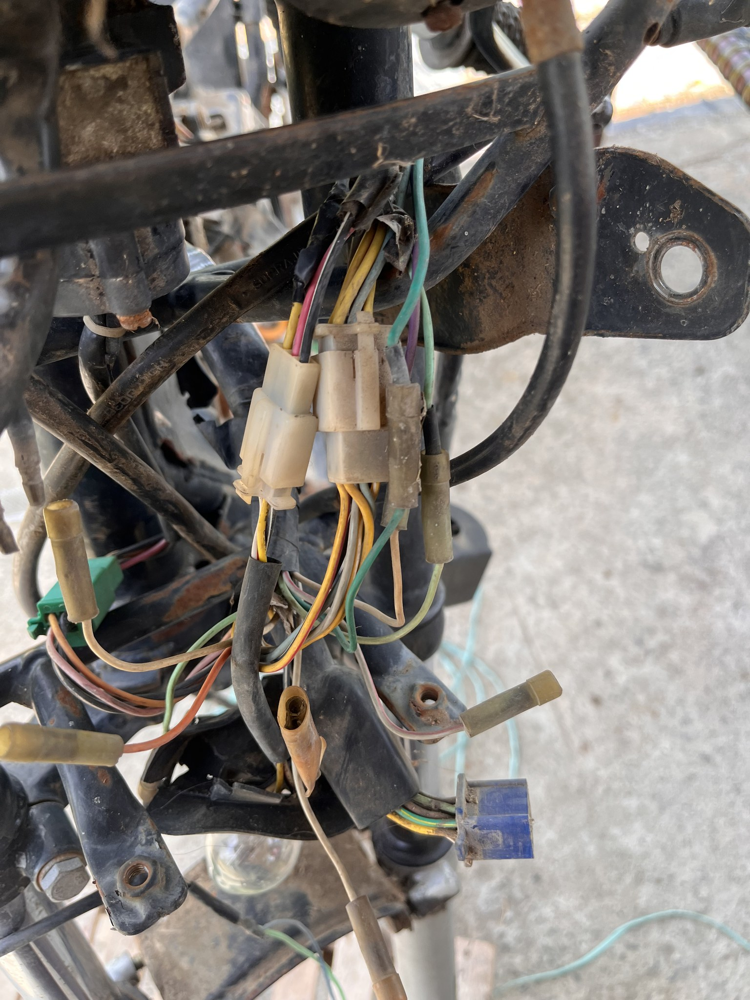

Close-up of the front wiring harness with several beige multi-pin block connectors and numerous colored wires (yellow, green, pink, brown) grouped together against the black frame and fork tube. A green two-pin connector and bullet terminals are visible. Shot outdoors on concrete.

### DC wiring connectors at handlebar

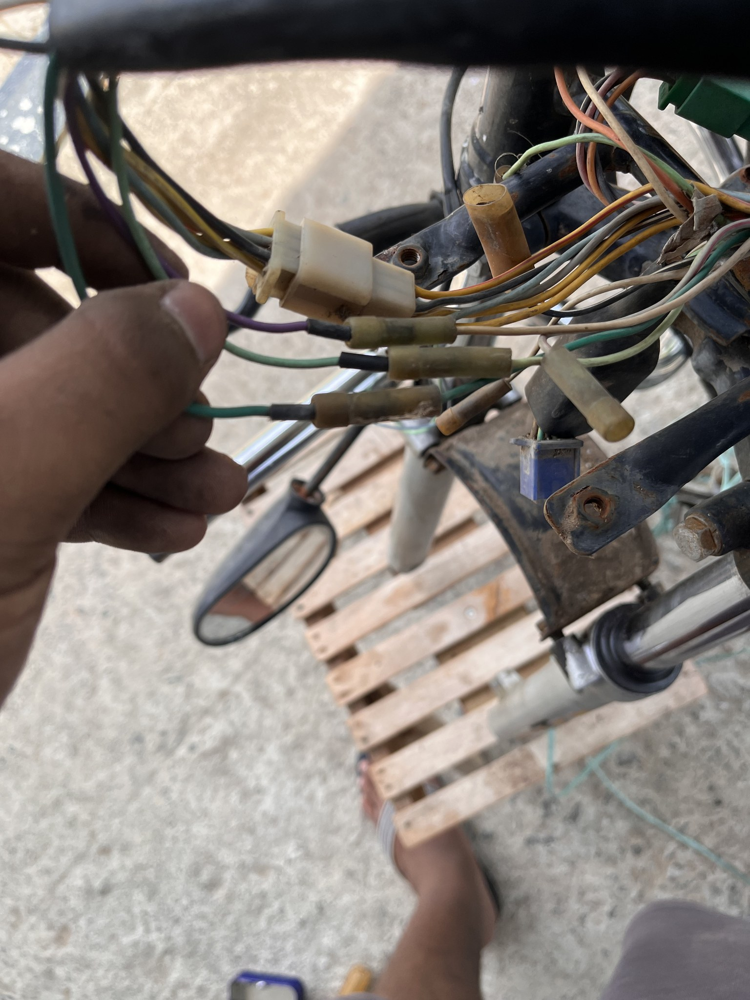

A hand holds a bundle of colored wires with bullet connectors and a white multi-pin connector block at the front of the bike near the handlebar and chrome fork. Many loose wires and insulating sleeves are visible; a round rear-view mirror and a wooden slat surface are in the frame.

### Wiring harness held during DC conversion

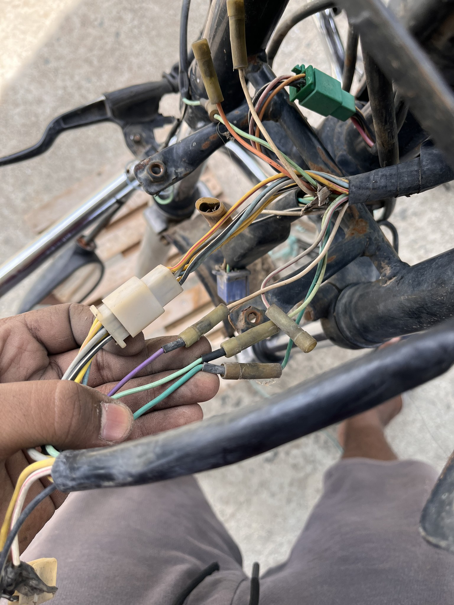

A hand holds several colored wires terminating in bullet connectors and a white connector block near the steering head and frame tubes. The bike is partly dismantled with exposed wiring, a green connector, and bare frame visible in an outdoor setting.

### Hand holding wiring harness connectors

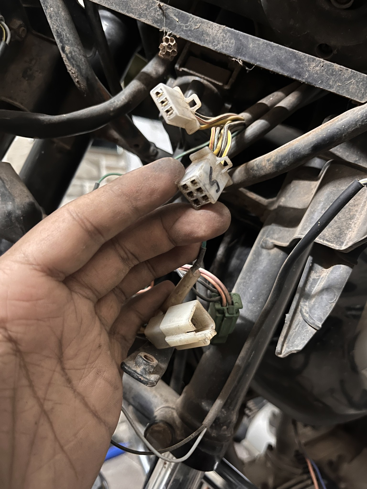

A close-up of a hand holding several white multi-pin electrical connectors and couplers with colored wires, in front of the bike's frame tubing and engine area. Multiple wiring plugs are visible, including a green connector on a lower wire. Consistent with electrical wiring and DC-conversion work.

### Hand holding wiring connectors during rewiring

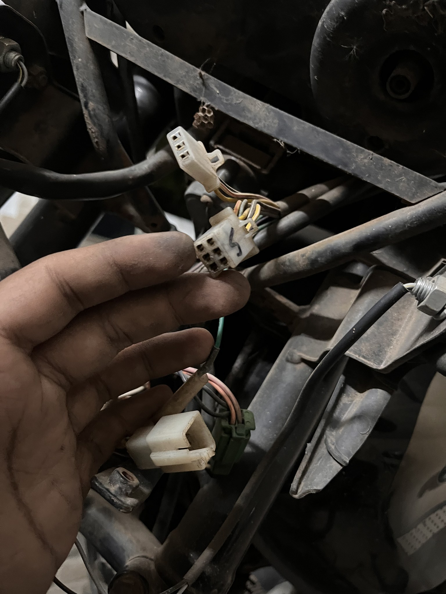

A hand holds two white multi-pin electrical connectors joined by a small wiring harness, in front of the grimy, dusty frame and engine area of the bike. Colored wires (green, brown/pink, yellow, black) run from the connectors. A green single connector is also visible below. Bare metal frame tubes and cables surround the work area.

### Wiring connectors held up close during rewiring

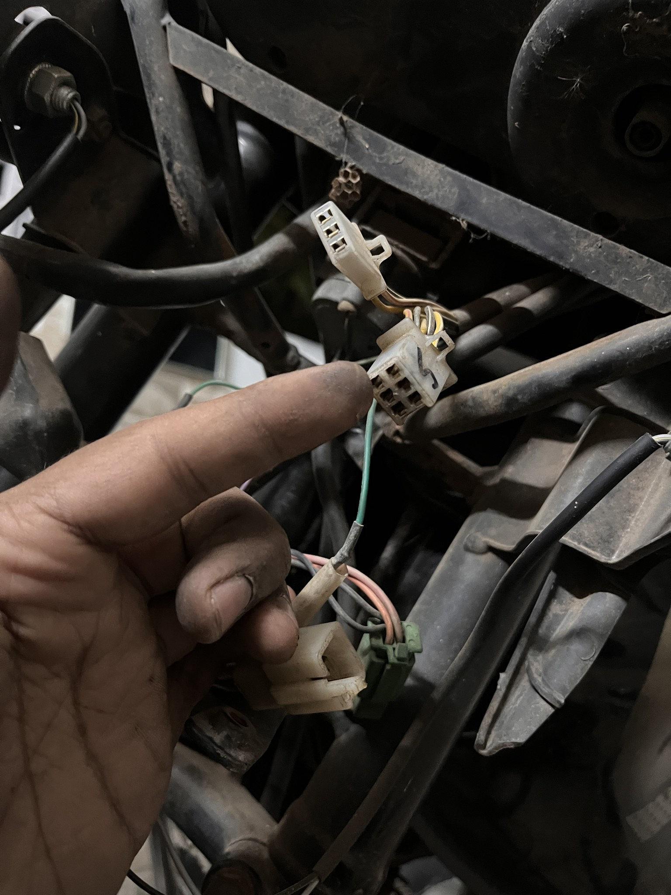

A finger and hand hold up the same set of white multi-pin electrical connectors and a smaller white bullet-type connector, with green, pink and brown wires visible. The background is the dusty frame, cables and engine components of the bike. Very similar framing to the previous connector photo, from a slightly different angle.

### Front wiring harness exposed at handlebar area

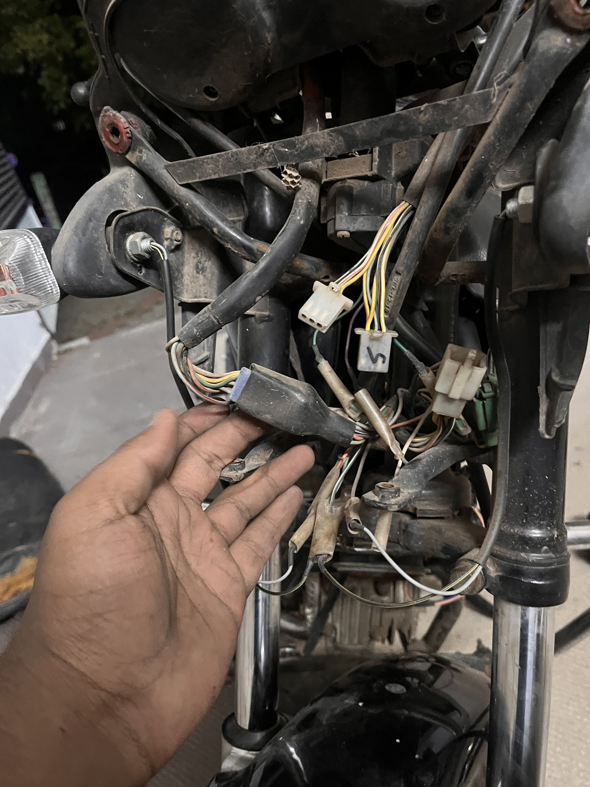

A hand holds a taped wiring bundle at the front of the bike, near the headstock and front forks. A dense tangle of exposed wires and multiple white and green connectors spreads across the frame, with a turn-signal indicator visible at left and the chrome fork tube at right. The scene is outdoors and documents the exposed front electrical harness during the rewiring/DC conversion.

### Hand holding wiring connectors during electrical work

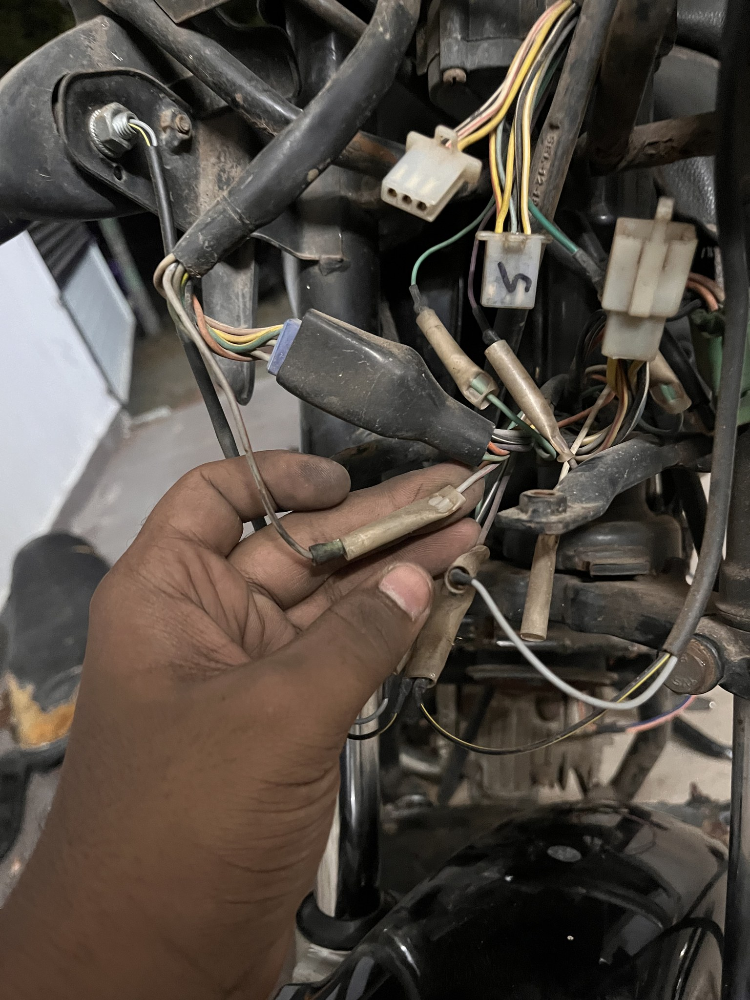

A hand holds a bundle of wires and bullet connectors pulled out from the bike's handlebar/headstock area. Multiple multi-pin block connectors (white and grey), a rubber-booted connector, and various coloured wires are visible against the dusty frame. Loose crimp terminals and taped joints suggest active rewiring.

### Hands holding wiring harness connectors during electrical work

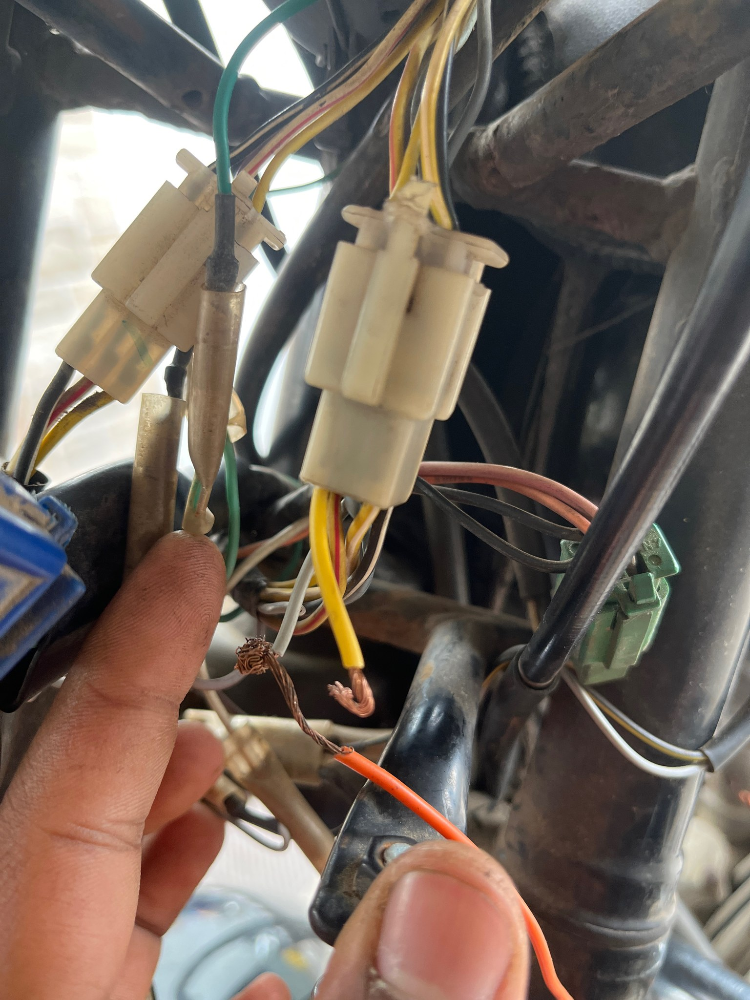

Close-up of two hands holding several white multi-pin wiring connectors and bullet terminals against the frame and wiring loom of the motorcycle. Green, yellow, black, white, brown and an orange wire are visible, along with exposed twisted copper strands where two wires are being joined. A green relay/connector block is mounted on the frame at right.

### Hand holding harness connector with spliced wires

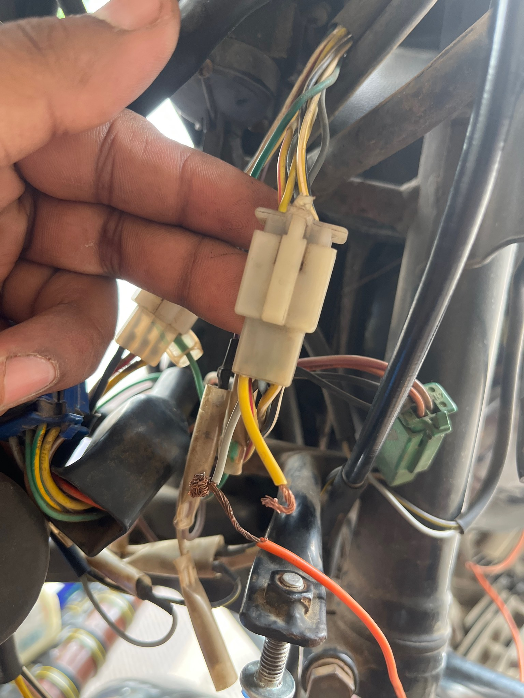

Close-up of a hand holding a white multi-pin wiring connector wrapped with tape, with yellow, green, white and black wires and a taped bullet terminal below it. Twisted exposed copper strands join two wires, and an orange wire runs down to a bolt on the frame. A green relay block and additional loom wiring are visible on the frame at right.

### Multimeter testing bike wiring connectors

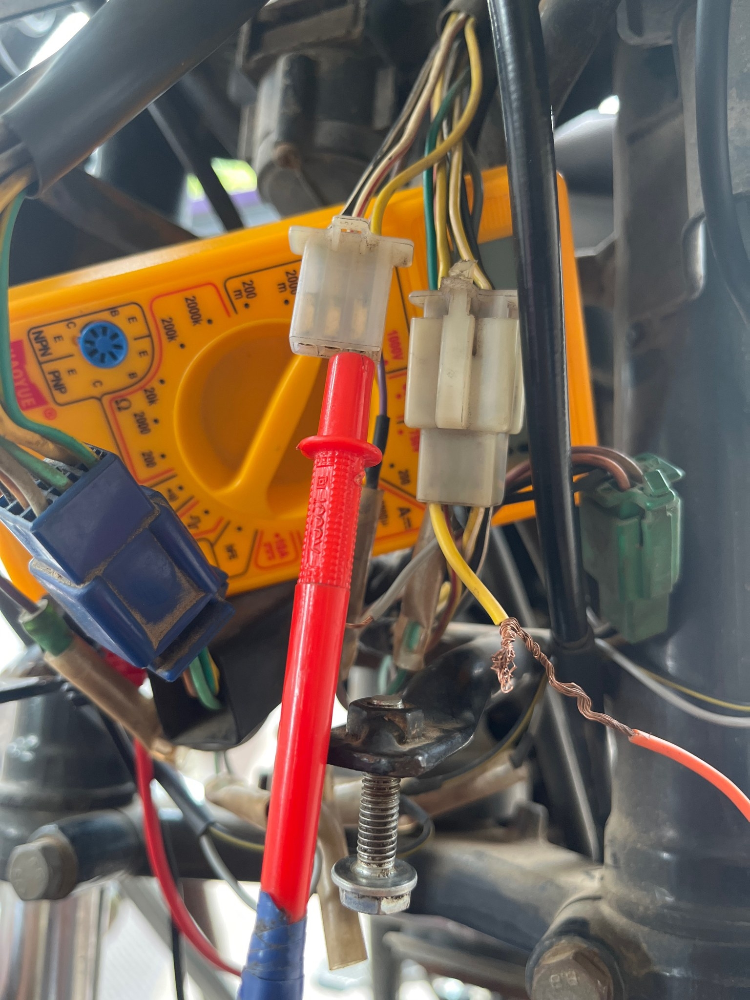

A yellow digital multimeter with a red test probe is being used against the bike's wiring harness. Several plug connectors are visible (blue, green, and white multi-pin blocks) along with loose yellow, brown, red and orange wires, an exposed twisted copper strand, and a bolt on the frame in the foreground.

## The LED headlight

### Blue LED projector headlight and DC wiring

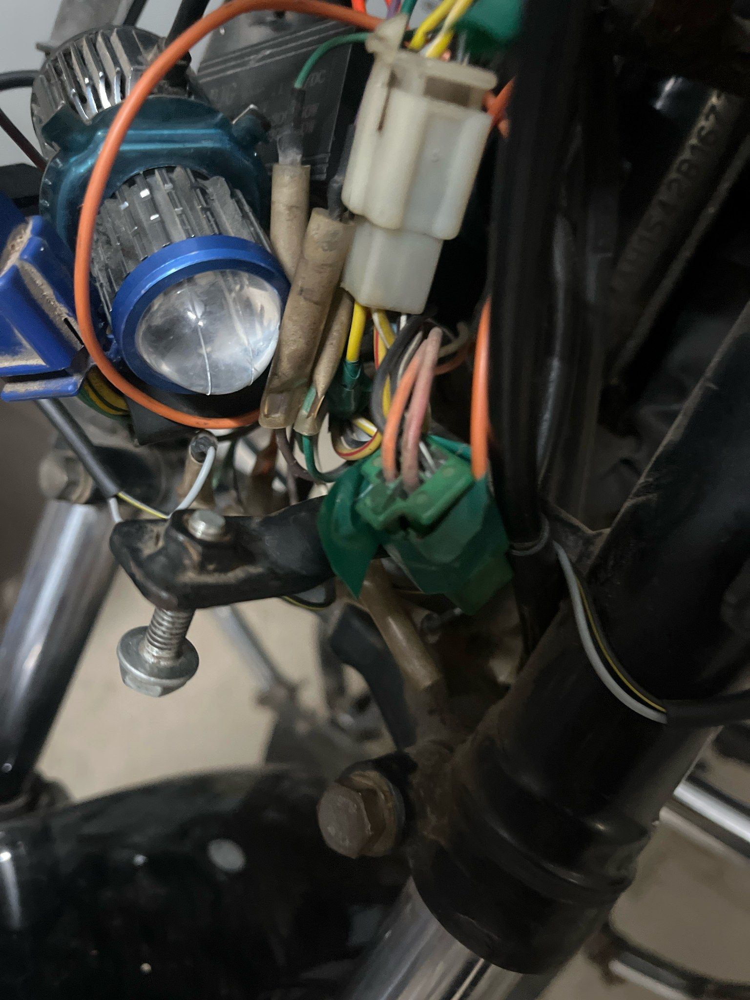

A blue-bodied LED projector headlamp with a finned heatsink is mounted at the front of the bike, with an orange wire looped over it. Beside it is a bundle of wiring including a white multi-pin connector, a green connector/relay, and assorted yellow, orange and brown wires. A black fork tube and chrome components are visible below.

## Parts, laid out

### Carburetor and cylinder head close-up

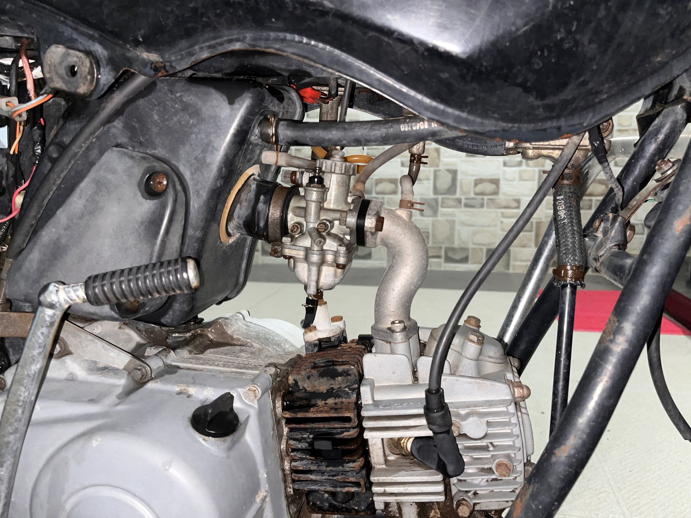

Close-up of the engine's right side showing the carburetor, curved metal intake manifold, and the finned cylinder head with a black spark-plug cap and ignition wire. A kick-lever return spring, throttle/choke cable, and a bundle of colored wiring (including an orange wire) are visible, along with molded text on nearby rubber components. Background is a stone-tile wall with a red mat below.

### Carburetor and wiring harness detail

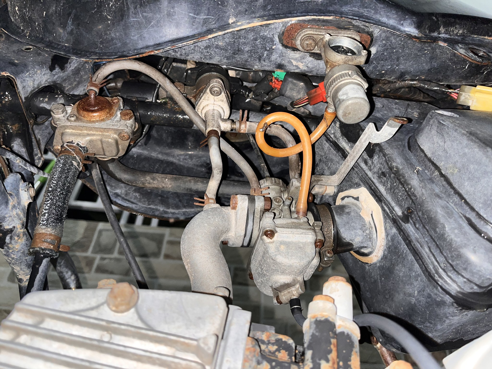

Close-up under the seat/tank showing a carburetor at center-bottom with metal and rubber fuel lines, an orange looped vent/overflow hose, a fuel tap on the left with a rusty screw-top, and a cluster of multi-pin wiring couplers (green, red-black, yellow) across the upper area. Grime and light surface rust are visible. Tiled floor in the background.

### Dismantled parts laid out on floor

Veranda floor covered with removed motorcycle parts and tools during teardown. An engine component sits on a cloth mat at center, a drive/timing chain is coiled in the foreground, and a clear bottle of fluid, pliers, wrenches and small parts are scattered around. A black fuel tank sits at the left edge, with a pink bucket, yellow rope and a workbench in the background.

### Removed parts including exhaust and rear rack

Wide view of the veranda work area with removed parts spread out. Against the left wall are a chrome silencer/exhaust pipe on the ground, a rear luggage carrier rack with a red tail light, and a black plastic panel/mudguard. Toward the right are an engine component on a mat, a coiled chain, scattered hand tools and a bottle of fluid, with a house doorway, pink bucket and cabinet in the background.

### Removed parts laid out: engine, tank, carrier, tail light

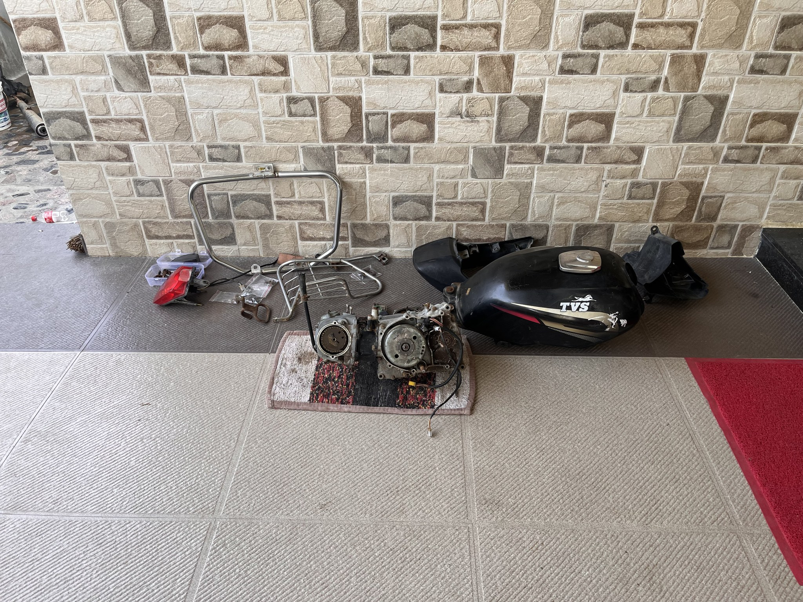

Multiple dismantled motorcycle parts are arranged on the floor against a stone-tile wall. From left: a chrome tubular carrier/rack frame, a red tail light, small hardware, an engine sitting on a woven rug, a black fuel tank with a TVS logo and graphics, and a black side cowl/panel.

### Cannibalised parts laid out on floor

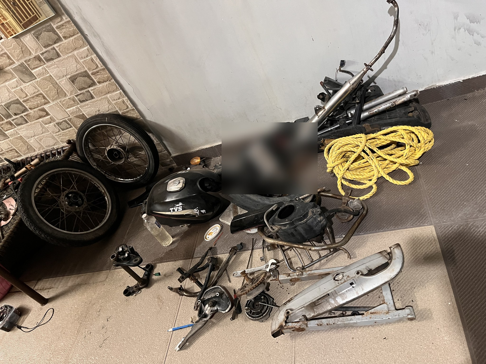

An overhead view of dismantled motorcycle parts arranged on a tiled floor. Visible items include two spoked wheels with tyres on the left, a black fuel tank marked 'TVS', a number plate, front fork/suspension tubes, a rusty exhaust silencer on the right, a centre stand, a swingarm, small brackets and fasteners, and a coil of yellow rope. Parts range from clean to rusted.

### Dismantled parts laid out on cot

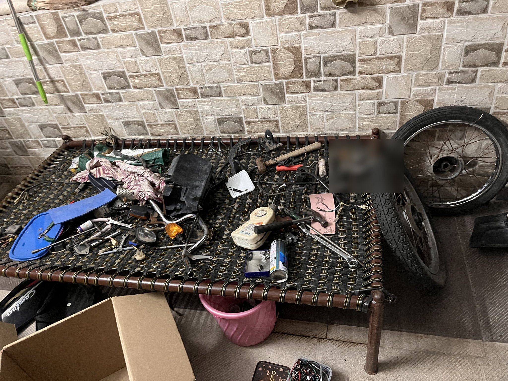

A woven cot holds an assortment of stripped motorcycle parts: a wiring harness, black plastic covers, a blue plastic side panel, handlebar and fork tubes, a mirror, an amber indicator, and a spray can. A spoked wheel rim with tyre leans against the cot, and a cardboard box and pink bucket sit on the floor.

### Dismantled Centra parts laid out on floor

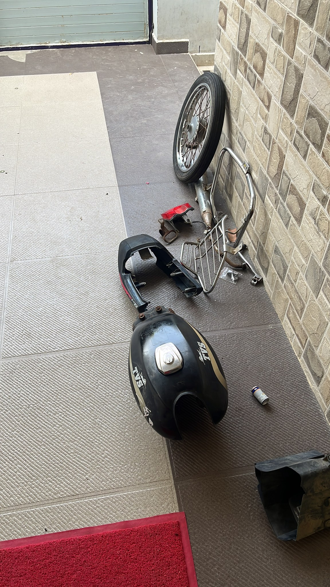

Several motorcycle parts arranged on a tiled porch floor beside a brick wall: a spoked front wheel with tyre leaning against the wall, a black fuel tank with a TVS logo, a chrome tubular front carrier/luggage rack, a small red tail/indicator lamp, a black headlight cowl or front mudguard, a small canister, and a dark rusty exhaust/silencer in the bottom-right corner.

## Restored & running

### Restored TVS Centra side profile at home

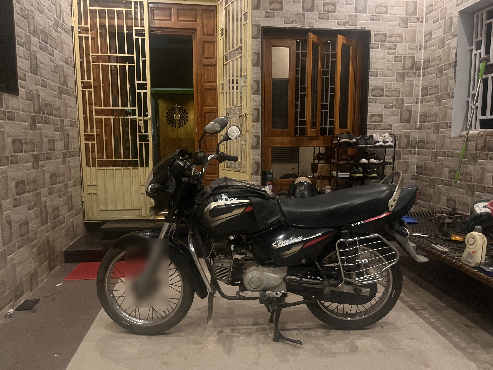

Full left-side profile of a complete black TVS motorcycle parked on its center stand on a tiled porch with a stone-pattern wall behind it. The bike has intact side panels, seat, rear grab rail/carrier, mirrors, spoked wheels and full bodywork. A shoe rack and household items are in the background; a partly worn license plate is visible on the front fender.

### Restored black TVS Centra, night hero shot

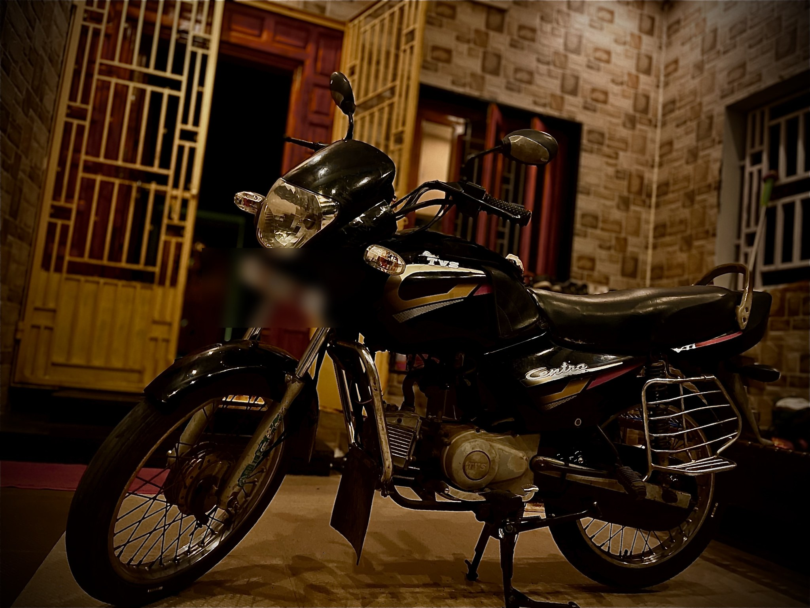

A fully assembled black TVS Centra motorcycle stands on its center stand in a dimly lit indoor/veranda setting. The round headlamp, front turn indicator, mirrors, fuel tank, seat, rear grab rail and spoked wheels are all in place. The 'Centra' side badge and 'TVS' engine cover marking are visible, and a front number plate reads a TN registration. This reads as a finished/restored beauty shot.
